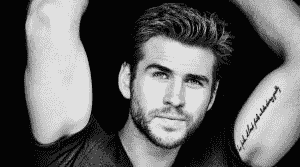
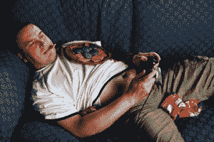

# 成为大男人

> 原文：<http://manlymenblog.com/2018/02/17/become-the-alphamale/>

人们更容易被强势的阿尔法男性所吸引，而不是弱势的贝塔男性。

但是做一个**大男人**意味着什么呢？

***阿尔法男性的特质***

***很吸引人，***

因为他们给你带来人生的成功。

女人都想和胜利者在一起。他们想要一个能给他们的生活增加价值的人，而不是一个需要她的东西的失败者。阿尔法男性让她感到安全，和她在一起很有趣，通常生活也更有趣。他们是社会的领导者。

大多数男人都是贝塔。为什么？因为这样更容易。人懒，省力。做一个软弱的好人，呆在家里的沙发上玩电子游戏，比走出去，享受生活，做出点成绩要容易得多。

那么是什么让一个人成为所谓的大男人呢？要找的特征是什么？更重要的是，你如何展示这些特质来利用它们？

为了在女人或生活中获得成功，自信是关键。自信不应该被误解为过于傲慢。阿尔法男性对自己的皮肤感到舒适。他不让恐惧支配他的行动。他觉得与人交谈很安全。

他把每一种情况都视为一种挑战，知道自己会成功，而不是被不安全感所拖累。因为他自信，他也更倾向于在生活中承担必要的风险。他可能有点自大，但通常伴随着巨大的幽默感，这是一个杀手组合。

领头的雄性是一只占主导地位的雄性。

他是一个领导者。

他会领导一个女人，但男人也会尊重他，追随他。请注意，当他带头时，他并没有控制她，也没有试图把他的领导权强加给她。他有能力用他的智力和社交技巧影响他人。

他是决策者。他不会问她想去哪里或想吃什么……例如，一个大男人会说: *“我们喝完酒去(这个地方)吃点东西吧！”* 一个贝塔雄性会更经常地做出一个含糊的声明或问题，寻找别人来带头。*这个地方很无聊，我饿了，你呢“或者你想多呆一会儿？”*

大男人总是在方向盘后面。他会选择自己的方向。

阿尔法永远不会失去冷静；他总是**冷静**和**克制**，他不轻易发脾气。他有能力应对压力，而且**情绪稳定。即使面对拒绝，他也总是以冷静的方式回应，并向她表明没人能那么容易打破他积极的精神状态。他将利用他所学到的，调整他的技能，并开始寻找新的挑战。**

一个贝塔男，在同样的情况下，通常会做出伤害、悲伤和可怜的反应；这反过来会让他更没有吸引力。事实上，他刚刚证明了她的权利，并向她表明，她拒绝他是正确的。更糟糕的是，之后他会继续追她，把责任推给她，直到她完全被击退。

**[相关帖子:如何判断她是否喜欢你](http://manlymenblog.com/2018/12/22/how-to-tell-if-she-likes-you/)**

[在这里下载你的免费电子书](https://mailchi.mp/896b52eba5bd/manly-men-blog-e-book)

你可能已经知道了，

沟通通常更多发生在潜意识和非语言层面。

与男性相比，女性更擅长解读一个情景/对话的非语言方面。这意味着只要看着你的身体语言，她就能知道你是否合适。她会注意到，一个阿尔法男性有一个非常开放，自豪和正直的姿态。他不害怕在场和占据空间。他不回避眼神交流，带着友好的微笑。他说话大声而缓慢，非常有控制力，一点也不紧张。他很悠闲，通常有一种轻松的做事方式。(在后面的文章中，我们将深入探讨这个主题。)

女人不只是读懂你的肢体语言。他们也注意到社会环境。一个有价值的人通常会成为谈话的中心。他是房间里的社交中心，女人会注意到这一点。人们对他做出反应，而不是相反。他知道如何与人交往，而且社交能力很强。

一个真正的阿尔法是不寻求关注的。他不需要不断的验证来增加自尊。他没有试图让自己符合她的标准。他让这个女人符合他的条件。他向她展示了一种**的意愿，即走开**，而不是扑倒在她的脚下。他没有崇拜她，而是让自己成为奖品。

**[相关帖子:如何变得对女性更有吸引力](http://manlymenblog.com/2018/02/17/howtobecomemoreatttractivetowomen/)**

她知道他想要的不仅仅是一张漂亮的脸蛋。她知道她必须加强她的游戏。这也是为什么他不会整天给她发短信。这是一件测试版的事情，因为这会显得你非常需要她，会降低你对她的价值。当他和一位美女说话时，他会有一种强烈的**权利感。他的心理框架是他给她一个证明自己的机会。**

阿尔法关心人类。他可以很慷慨，也很有骑士风度。虽然他带领女人，他仍然能为她开门，在雨中提供他的外套，在公共汽车上为她站起来，…但是一个男人追她和崇拜她是有明显区别的。他不是为了上她而示好的！他这样做是因为他觉得这样做是对的。他是对的:一个真正的男人会照顾一个女人。

阿尔法男性非常**驱动**和**专注**。他有人生目标，知道自己想去哪里。他的主要目标不是得到女人！为了成功，他不断努力提高自己的技能。他有许多其他的目标:辉煌的事业、金钱、健康、好朋友、爱好……

在女人面前成功只是其中的一小部分。幸运的是，这正是他如此迷人的原因:

女人不是他的人生使命。

那么，你认为你具备成为一个大男人的条件吗？

**敬请期待！**

订阅男子汉博客吧！

**改变你的生活！**

[在这里下载你的免费电子书](https://mailchi.mp/896b52eba5bd/manly-men-blog-e-book)