# 要避免的 8 个常见风格错误

> 原文：<http://manlymenblog.com/2018/03/02/8-common-style-mistakes-to-avoid/>

# ***“人靠衣装！”***

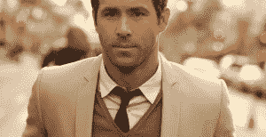

这听起来可能有些老生常谈，但绝对不是轻描淡写。

如果你想让人们更认真地对待你，你就得穿得得体一些。下面我将向你展示 8 个最常见的时尚错误。不惜一切代价避免这些风格错误。

***穿得潇洒，看起来犀利！***

## **1。你穿的不合适。**

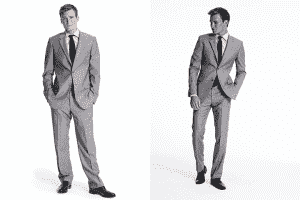

如果你总是想知道为什么衣服穿在你身上看起来不如穿在别人身上好看，那么你很可能弄错了。这听起来很简单，但却很重要。这一条做对或做错，会成就或毁掉你的服装。

即使你其他方面都做得很好，你也可能会毁了你的整体形象，而你自己却没有意识到。

如果你穿太宽松或太紧的衣服，你就不能补充你的身材。你可能认为穿超大号的衣服会隐藏你的问题区域。你猜错了，你只会引起他们更多的注意。如果你是个瘦子，那只会让你看起来更瘦，因为你没有把衣服撑大。如果你比较大，宽松的衣服会让你看起来更大。

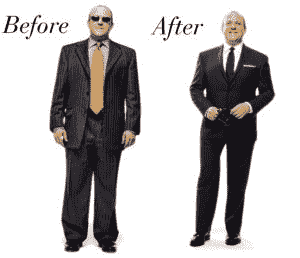

穿着合身的衣服，你的姿态看起来好多了。

太紧的衣服也不是正确的选择。例如，它可以让你的腹部更加突出。

如果你是一个非常强壮的人，不要炫耀。不要把衬衫穿得太紧，那样会切断你的血液循环。

## **2。你不注意你的鞋子。**

许多男人没有意识到穿合适的鞋子的重要性。你的衣服可能会非常锋利。如果你穿错了鞋子，你所有的努力都将付之东流。你穿的鞋子代表了你自己的形象。如果你穿廉价、破旧、肮脏的鞋子，人们(尤其是女人！)会注意到。

你也可以穿不适合你服装的鞋子。知道什么时候穿漂亮的礼服鞋，什么时候穿运动鞋。这在很大程度上取决于你的着装、所处的环境，以及你是想打扮自己还是穿着休闲。

不要在鞋店买便宜货，选择一些高质量的鞋子。之后，好好照顾他们。这是值得的。

此外，避免明显的。有些鞋子就是难看。

方头礼服鞋:作为一个有男子气概的男人，你现在会忘记它的存在。

## **3。你要么穿得太多，要么穿得太少。**

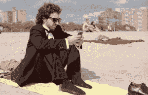

虽然我提倡大部分时间稍微过分打扮，但这很容易过分。虽然穿得过多并不像穿得过少那么糟糕，但你仍然需要避免。你想因为你在着装上付出的努力而受到关注。但是你不想显得格格不入，或者显得你太努力了。

对于每一个场景，你必须判断适当的正式程度。不言而喻，为工作面试打扮和准备去海滩玩是不一样的。你必须考虑情况，问自己正确的问题:

***是正式的还是比较随意的活动？***

***别人会怎么穿衣服？***

***有着装规范吗？***

***我想要/需要显示什么图像？***

***谁会在那里？***

当有疑问时，稍微打扮一下总是更好的选择。成为最不体面的人不是你想成为的人。这会给人们一个错误的(大部分是坏的)印象。再加上会消磨你的自尊心，让你很潜意识。

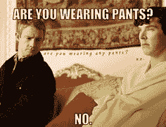

***这不都是表面的扯淡吗？***

是的，它是！很抱歉告诉你。这个世界很肤浅，你的穿着会影响别人对你的看法。只是按规则办事不会让你变得浅薄。

## **4。你穿着一件没扣的礼服衬衫。**

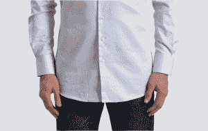

***我应该把衬衫掖好还是解开？***

你不会想穿上一件漂亮的衬衫，但看起来仍然像个邋遢鬼吧！

要知道答案，你必须问正确的问题:

我穿的是什么类型的衬衫？它是不是应该被塞进去？

平底褶边的衬衫是用来穿的。当下摆长度变化时，你的衬衫应该塞进去，而不是四周都是。

同样重要的是你衬衫的长度。如果你想不穿裤子，选择短一点的款式。当你的衬衫太长时，一定要把它塞进去！！！

想要找到合适的衬衫长度，请看下面的图片:

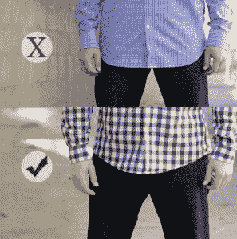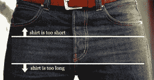

## **5。你不是健身出了**

**“如何变得更时髦。”**

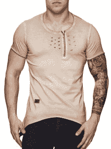

事实是:你越苗条，肌肉越发达，你穿的衣服就越好看。当你开始裸体看起来更好的时候，你穿上衣服也会更好看。当你有一个惊人的身材，穿着合适的衣服，你只需要一件 t 恤和牛仔裤就能看起来惊人。

另一方面，如果你真的身材走样，出去买合适的衣服就更有挑战性了。你的选择会变得不那么自由。很多你喜欢的衣服也会让你觉得不舒服。另外，你经常会试图掩盖你的“问题领域”。

当你身体健康时，生活会变得更容易。

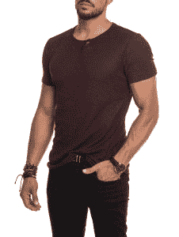

最难的抬起动作是把你的屁股抬离沙发！

想被撕，却不知道如何下手？ [**在此一探究竟！**](http://manlymenblog.com/2018/02/02/reasons-why-you-are-not-building-muscle/)

## **6。你戴的配饰太多了。**

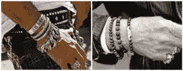

**当真？生活不是音乐视频**

作为男人，可以佩戴配饰。但是如果你做了，明智地去做:让它符合你的风格，而不是压制它。少点珠光宝气。

如果你在你的风格中加入了配饰，这表明你花了一些心思。但是要小心，有些规则你应该遵守:

**穿 2 到 3 件通常绰绰有余。**

混合这些金属会破坏平衡。尽量保持颜色一致。

**一块好看的手表永远是最好的选择。**

**少即是多，避免膨体手镯或项链。**

**【正式 vs 随意】**

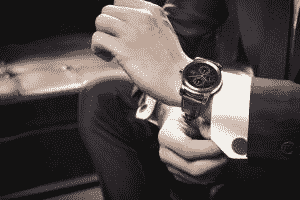

**佩戴一块好看的手表，与你的风格相得益彰。**