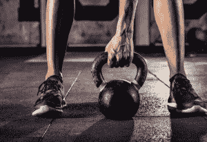
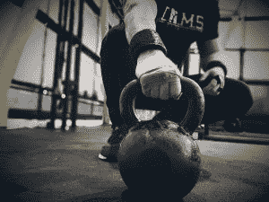
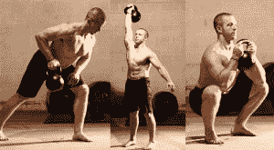
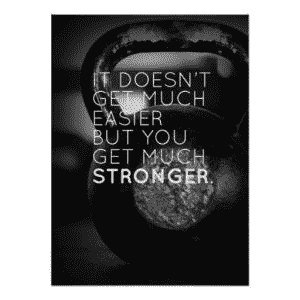
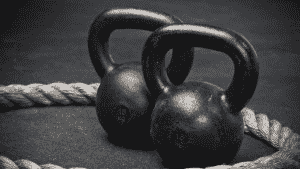
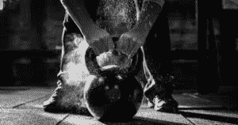
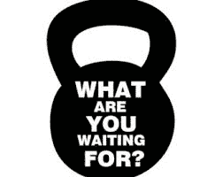
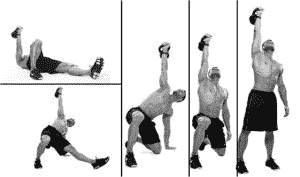
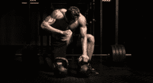

# 壶铃训练:今天开始的 7 个理由！

> 原文：<http://manlymenblog.com/2018/11/18/kettlebell-training-reasons/>

# **壶铃训练:**

# *7 大福利&今天开始的理由*

是的，我们明白了。

生活是忙碌的。

你真的想要你一直梦想的那种惊人的体格。你想被撕裂和精益。另外，你还想在此基础上增加些肌肉。但有时生活会阻碍我们。

不管是什么:工作、学校、孩子、爱好……就好像你从来没有属于自己的时间。你只是没有看到自己每天去健身房训练 1.5 个小时。

在这种情况下，**壶铃训练**可能正是你所需要的！它超级有效，而且很容易适应你已经很忙的时间表。除此之外:**要想感觉像个真正的男人，没有什么比摇着沉重的壶铃更好的了。**

## ***什么是壶铃训练？***

那么壶铃到底是什么？它看起来像一个有把手的炮弹。它有不同的大小和重量，取决于你的力量和目标。它起源于俄罗斯。苏联军队用它们来进行体能训练。后来由苏联特种部队训练师 [帕维尔·察苏林](https://en.wikipedia.org/wiki/Pavel_Tsatsouline)在全球推广。

它的设计不同于哑铃或杠铃，因为它旨在以更动态的方式使用。

如今，你也可以得到可调手重。这样你就可以用大头针改变壶铃的重量，这样你就不需要买各种尺寸的了。

[已经打气要自己弄一个了？在这里找到你的壶铃！](https://amzn.to/3hBhhMO)

## ***壶铃训练有什么好处？***

### ***这是一种有氧运动&力量锻炼***

最大的好处是壶铃训练是力量训练和心血管训练的结合。你不必决定:

我今天会做有氧运动或力量训练吗？

有了壶铃，你可以两者兼得。

壶铃的设计不同于哑铃或杠铃，因为它们旨在以更动态的方式使用。它们旨在让你动起来。当你开始摆动壶铃时，你的心率会立刻上升。这是一项很棒的有氧运动。当你看到你的汗水滴落在地板上时，你会喘不过气来！

与此同时，你正在增强和调整你的肌肉。

(相关帖子: [你没有锻炼肌肉的五大理由](http://manlymenblog.com/2018/02/02/reasons-why-you-are-not-building-muscle/) )

在**高强度间歇训练(HIIT)或塔巴塔**中使用非常棒。在 HIIT 训练中，你将进行短时间的剧烈运动，与短时间的休息交替进行。在短时间内，你将能够燃烧掉一吨**卡路里，**让壶铃成为你减肥目标的一个伟大工具。

许多壶铃练习是复合动作，也就是说它们同时锻炼几块肌肉。这样你会很快燃烧更多的卡路里。所以在你意识到之前，你就已经开始练六块腹肌了。

### ***壶铃训练远非枯燥***

很多人觉得做有氧运动很无聊。有氧运动通常指的是低强度的耐力训练，比如在跑步机上跑步。壶铃训练是为了让有氧运动再次变得有趣。有大量不同的练习可供选择，所以你不会感到无聊。大多数锻炼都是在**循环**中从一项锻炼进行到下一项锻炼，而不需要放下壶铃。

所以没必要再在跑步机上浪费时间了。只要给自己买一对壶铃，你就可以开始了。除了给你带来好的结果，他们还会给任何锻炼计划增加多样性。30 分钟的锻炼很快就会过去。

当你习惯于做常规力量训练时，做壶铃训练也可以是一种解脱。你不需要在每一组之间休息和等待，就像当你举起一个沉重的杠铃时。对许多人来说，这使得壶铃训练比举重更令人愉快。

(相关帖子:[为什么每个男人都应该举重](http://manlymenblog.com/2018/06/13/this-is-why-every-man-should-lift-weights/))

[在这里下载你的免费电子书](https://mailchi.mp/896b52eba5bd/manly-men-blog-e-book)

### ***壶铃训练会改善你的体态***

开始壶铃训练的另一个原因是当你的姿势或下背部有问题时。几乎任何壶铃运动都会锻炼你的核心肌群。它会增强你的**腹肌**、你的**斜肌**和你的下部**背部**和**脊柱**肌肉。

壶铃练习都是关于**平衡**。即使你在做单臂运动，你也需要你的核心和肩部肌肉来平衡壶铃。壶铃可能是你保护背部和保持良好姿势所需要的。

### ***壶铃训练简单&方便***

壶铃运动通常非常容易学习。只要有一点耐心和专注，任何人都可以做到。要开始，你只需要学习 7-8 个练习，给自己一个壶铃就可以开始了。首先，确保你选择了一条对你的上半身和下半身都有效的线路。当你习惯了基本的练习，你可以在以后增加额外的和更复杂的动作。

**开始做的伟大练习是**:

[两臂摆动](https://www.youtube.com/watch?v=YSxHifyI6s8)

[单臂摆动](https://www.youtube.com/watch?v=lax7Em1FzYA)

*高脚杯下蹲*

*抓举*

*单臂按压，*

*一臂排*

*肩晕*

*臀晕*

*弓箭步*

这些都是让你强壮和健康的好运动。稍后我们将深入解释这些练习。

**你可以在这里找到一个很棒的免费初学者套路**:

[壶铃](https://www.youtube.com/watch?v=DoyG9r086pE) [初学者锻炼](https://www.youtube.com/watch?v=DoyG9r086pE)

如果你正在寻找更高级的运动，**，**你可以尝试以下两种运动之一:

[15 分钟壶铃训练视频](https://www.youtube.com/watch?v=gcIFAgnOL9E)

[Agatsu 高级脂肪燃烧器](https://www.youtube.com/watch?v=D6Hf8DJ1crM)

或者你可以跟随 Pavel 的一项训练:

[壶铃简单&阴险](https://amzn.to/3e8lci1)由帕维尔

[进入壶铃:苏联超人的力量秘密](https://amzn.to/2UPMUIQ)

壶铃很方便。你不需要一个昂贵的健身房会员来锻炼。你可以在自己家里**在自己的客厅**进行这种锻炼。你需要的只是一个壶铃和正确的纪律和动力。最好从 1-2 个不同重量的壶铃开始。您可以稍后添加更多内容。

它们不占太多空间，易于存放，也不会花你太多钱。另外，一个好的锻炼不一定要占用你太多的时间！

谁知道呢？这可能完全符合你建造自己的健身房的计划。

小心！如果你有宠物或小孩在附近走动，摇铃铛时要格外小心！

### ***壶铃训练对你的关节有好处***

如果拥有良好健康的关节对你很重要，壶铃训练将是你的理想选择。你可以**加强你的关节**和**防止将来受伤**。

壶铃训练的动态动作将提高你的关节灵活性。用轻到中等的壶铃训练将会提高你的肌腱和韧带的弹性。此外，做像壶铃摆动这样的练习会提高骨盆和髋关节的稳定性和灵活性。随着训练的进展，小的稳定肌肉会变得更强壮。这将导致更稳定和更有弹性的关节。

提高关节稳定性的完美动作是[壶铃土耳其起床](https://kettlebellsworkouts.com/7-steps-of-the-kettlebell-turkish-get-up/)。

### ***壶铃训练大量使用复合动作***

壶铃训练的主要重点是全身运动。这意味着你将在每次锻炼中锻炼更多的肌肉，使运动更加有效。例如，[k](https://www.youtube.com/watch?v=YSxHifyI6s8)[ettlebell swing](https://www.youtube.com/watch?v=YSxHifyI6s8)几乎会作用于你身体的每一块肌肉。

因为你在每次锻炼中使用了更多的肌肉，所以你需要更少的时间来做一个适当的例行锻炼。你会燃烧更多的卡路里，增强更多的肌肉！

### ***壶铃训练可用于主动恢复***

当你在进行以举重为基础的肌肉锻炼计划时，你会知道休息和恢复的重要性。这是你的肌肉从繁重的锻炼中康复的时候。这就是你的肌肉会越长越大的原因。

但是仅仅因为你不应该在休息日做任何繁重的工作，并不意味着你不能保持活跃。这就是壶铃训练非常有用的地方。

这将给你一个机会去做一种不同的但是更温和的锻炼。为了积极恢复，最好选择**轻量级**的锻炼。关键是保持你的血液循环，在不过度劳累的情况下给你的肌肉供氧。为了让你的心脏跳动，做一个高重复低重量的动态练习，而不是用壶铃举重

### ***结论:抓住生命的钟声*** &得到自己的壶铃！

这些就是开始壶铃训练的最大好处。

**尽快上手** **艾尔你需要的是一个壶铃！**

不知道在哪里可以找到一个高品质和负担得起的壶铃？你可以在这里找到一个！

一个成年男子的起始体重应该在 12 到 18 公斤之间。现在就开始行动，获得你一直想要的健美身材！

如果你喜欢读这篇文章，一定要订阅下面的。每周你都会在收件箱里收到**免费男人味的帖子**！

诚挚的问候

[在这里下载你的免费电子书](https://mailchi.mp/896b52eba5bd/manly-men-blog-e-book)

<link href="//cdn-images.mailchimp.com/embedcode/horizontal-slim-10_7.css" rel="stylesheet" type="text/css">