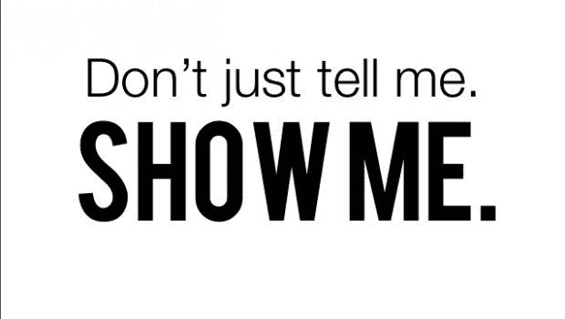

# 如何判断她是否喜欢你

> 原文：<http://manlymenblog.com/2018/12/22/how-to-tell-if-she-likes-you/>

# 她到底有没有被你吸引？如何辨别…

恭喜你！

你终于克服了你的 [**接近焦虑**](http://manlymenblog.com/2018/11/05/conquer-approach-anxiety/) 。你看到了这个迷人的女人。你鼓起勇气，勇往直前！这值得热烈的掌声！

但是困难的部分还远没有结束。在打全垒打之前，你还有很长的路要走！

现在你已经和她谈了一段时间，你想让事情更进一步。但要做到这一点，你必须知道她是否被你吸引。归根结底就是找到这个问题的答案:

***“她到底在不在我身边？”***

对于这个问题，得到一个简单明了的答案不是很容易吗？如果一个女孩告诉你可以吻她，这不是很容易吗？不幸的是，这永远不会发生。一个女人几乎不会公开表达她对你的吸引力。你得自己想办法。

对许多男人来说，试图弄清楚一个女人是否喜欢他是非常令人沮丧和困惑的。他们最终误读了她发出的信号，因此采取了错误的行动。例如，当你最终想要接吻时，你发现你已经被划分到了朋友区。

对我们男人来说看似微妙的事情，对大多数女孩来说通常是显而易见的。

## **感兴趣的指标**

幸运的是，虽然她永远不会直截了当地告诉你她的感觉，但女人会给你微妙的信号，表明她喜欢你还是不喜欢你。如果她被你吸引，她会给你**个兴趣指标**。

感兴趣的指标是女人的行为，这些行为表明她对你有意思。当一个女人被你吸引时，她会有意识或无意识地表现出这些特征。

如果你想学会如何勾引女人，关键是你要学会如何解读这些信号。因为，如果一个女人(还)没有被你吸引，你就无法进入下一阶段。

在本帖中，我将为您提供一份常见和不太常见的兴趣指标列表。你应该知道，你应该总是小心使用这个列表！

有些女性会使用虚假的兴趣指标。这可能是由许多不同的原因造成的。有些女孩喜欢和每个人调情，喜欢被关注。一些女孩发出**混合信号**，因为她们想利用你……她们可以使用假指标，因为她们想让你帮她们一个忙。

幸运的是，不是所有的女人都是那样的。要正确解读她的信号，你需要丰富的经验。识别吸引力是一项你需要时间学习的技能。你越发展你的**自然直觉**，它就变得越容易！另外，你千万不要依赖单一的兴趣指标。在换挡之前，确保你得到了**多个积极信号**！

现在开始了。这是名单！

### 她让自己变得更有魅力

当她开始抚摸自己的头发时，这通常被认为是一种兴趣的表现，尽管并不总是准确的。当一个女人和她觉得有魅力的人交谈时，她通常会开始调整和修饰她的头发。她这样做是为了让自己更有吸引力。很多时候这发生在潜意识层面。当与强烈的眼神接触相结合时，该指标更强。

她还可以做其他事情来让自己看起来更有吸引力:**调整她的上衣**，**重新涂口红**，**摆弄她的珠宝，露出额外的皮肤，让她的裙子垂到肩上，脱下一层衣服，因为她很“性感”** …

她可能会开始放松自己，沿着脖子或锁骨滑动她的手。

她可能会改善自己的姿势，甚至可能会挺胸。

当她不停地舔嘴唇时，注意她。这可能意味着她准备好接吻了！

### **眼神交流**

目光接触总是一个强烈的兴趣指标，因为在眼睛里我们可以看到灵魂！

很多时候，在你走过去和一个女生搭讪之前，她会用眼神给你开**绿灯**。

当一个女人从远处给你眼神交流时，不要犯忽略它的错误。不要去等待另一个“更明显”的信号。她刚刚给了你一个！至少她是这么觉得的。如果你现在不行动，她会认为你不感兴趣。另外，如果你不等待太久，你会显得更自信，这意味着更有吸引力。

[在这里下载你的免费电子书](https://mailchi.mp/896b52eba5bd/manly-men-blog-e-book)

但是另一个不经意的一瞥和一个接近的邀请之间有什么区别呢？只要记住这三件事:

*   如果一个女孩和你有目光接触，短暂地看向别处几秒钟，然后**她再次锁定和你的目光接触**，你就被邀请了！
*   人们不经意地互相看一眼是很正常的。女人会和陌生人有一秒钟左右的眼神交流，然后看向别处。不正常的是**长时间的眼神交流**。如果你觉得目光接触的时间比通常的一瞥更长，你可以打赌还有更多！这不需要很长时间:几秒钟就足够了。
*   她的眼神交流伴随着她美妙的微笑，那你马上滚过去！她在用眼睛微笑吗？

当你已经在和她说话的时候，你也应该注意她的眼睛。当她喜欢你时，她会试着和你保持眼神交流。很明显，当她总是看向别处或者更关注她的手机而不是你的时候，这是一个非常不好的迹象。所以，下一次，试着注意她的注意力都指向哪里！

### **其他肢体语言线索**

如果你想知道她是否感兴趣，你必须注意她的肢体语言。通常，她的身体会告诉你更多关于她的意图。

她的身体指向哪里？这是针对你的吗？还是看起来她有别的地方要去？如果她的脚指向你，那是一个积极的信号。

如果她喜欢你，她的肢体语言会很“开放”。如果她总是**交叉双臂**，这可能意味着她仍然保持警惕。

你应该总是留意**物理上的接近**。她**说话时会向你倾斜还是保持距离？当然，离她越近越好。你想让她进入你的私人空间。当你进入她的世界时，你不想让她退缩。**

有时候，当你和你的朋友出去玩的时候，你会看到一个女孩总是离你很近。如果无论你去哪里，她总是“碰巧”在那里，这可能不是偶然的！

### **符合性**

如果你要记住这篇文章中的一件事，那就让它成为这篇文章吧！**合规性是最重要的指标！！！**

有时候很难通过她说的话或她的肢体语言来判断她是否喜欢你。通常你会得到混淆的信号，很难分辨。

那你怎么知道呢？很简单:合规！为了确定这一点，给她一个接受或拒绝你的机会。前进不一定意味着身体上的升级！前进意味着在互动中前进。那么，当你试图向前推进时，她会顺从吗？

要做出准确的判断，你必须看她的行动，而不是她的言语。当女人喜欢你时，她希望事情向前发展。她不想要的是自己让事情向前发展。她希望你负起责任，采取必要的步骤，当她感兴趣时，她会遵从你的领导。很多时候，她会通过自己的行动来表现这一点。

*Actions speak louder than words.*

以下是一些女孩顺从的例子:

*   你跟她说话时，她会一直呆在你身边，而不是找借口。
*   你碰她，她接受，甚至回碰你。
*   当你靠近时，她会让你靠近。
*   如果你要求她和你一起去别的地方，她会同意并同意你的要求。
*   她让你把她和她的朋友隔离开来。如果她不喜欢你，她会尽量避免和你单独在一起。
*   如果你邀请她和你跳舞，她会同意的。
*   当你邀请她去你家时，她同意了。她知道在那种情况下事情可能会升级。如果她不感兴趣，她会找借口。
*   每次你试图在身体上升级时，她都会顺从，例如当你试图握住她的手或把手放在她的腰间时。
*   当你俯身亲吻时，她会靠近你。
*   她让你搂着她。
*   你讲的笑话她都会笑，即使并不好笑。
*   当你坐下时，她同意和你一起坐下。
*   她让你带着她在会场里四处走动，去任何你想去的地方。
*   当你要求她帮你拿饮料时，她会帮你拿。

永远用一个女孩的行为来衡量她的兴趣，而不是她的话语。一个女生可以整晚跟你说她不在你身边，却依然顺从你的一举一动！放聪明点，相信她的行动。**(不要误解这最后一部分！不行还是不行！！)**

测试合规性时，使用您的**常识**。当你 5 分钟前刚认识一个女孩时，你不能请她回你家。这样不行。她会拒绝你的请求，尽管她可能仍然被你吸引。永远向前迈一小步。如果你操之过急，要求太多太快，她不会答应。

 **[**相关帖子:如何成为阿尔法男**](http://manlymenblog.com/2018/02/17/become-the-alphamale/)

### **关系状态**

很明显，当一个女人问你是否单身时，这总是一个积极的信号。当她开始约你出去谈你的爱情生活时，她很有可能对你感兴趣。虽然不是 100%准确，但通常是一个很好的指标。

她可能不会总是直接问这个问题，但她会尝试以某种方式找出答案。她甚至可以利用她的朋友从你那里得到一些信息，因为她自己也太害羞了。

此外，如果她是单身，她会希望你知道！如果她感兴趣，她会想办法让你知道的。例如，她可能会开始谈论找到一个让你体会言外之意的“好男人”有多难。或者她可以提到她刚刚分手，透露她的可用性。

另一方面，当一个女孩提到她有一个男朋友时，并不意味着她不感兴趣。是的，这可能意味着她有一个男朋友，她很高兴，不感兴趣。如果是这样，继续前进。但是，她说的并不总是对的。

她可能在测试你，看看你会有什么反应，她可能在玩欲擒故纵的游戏。或者她确实有男朋友，但是不幸福。有些女生从来都不是单身！

这就是为什么最好总是看她的行动，而不是她的话。再读一遍**合规**一章，弄清楚自己的立场。

那么道德困境呢？我只是来给你提供信息的。“我有男朋友”的反对是否会让你放弃追求，这是你的决定。

## 她在称赞你

当一个女人开始赞美你时，这总是好消息。对你漂亮的夹克或新鞋的赞美可能是无辜的。但是当她开始称你为“火辣”、“性感”或“英俊”时，可能还有更多含义。她直接告诉你她喜欢她所看到的。

### **她开始向你证明自己的资格**

如果一个女人想要你，她会想尽一切办法让你看得起她。这通常发生在某个社交**钩点**之后。通过展示自己是一个高价值的**男人**，你现在已经确立了自己是一个有吸引力的男人。

在你证明了自己配得上她，并且做得很好之后，她会倾向于把你当成奖品。常言道:生活中没有什么真正美好的东西是免费的。她知道她将不得不为你工作。这就是为什么她会开始**向你证明自己**的资格。她开始追你，试图赢得你的芳心。她会努力推销自己，表现得尽可能有趣。

### **物理升级**

如果一个女人不停地摸你的胳膊，她这么做是有原因的。她想告诉你一些事情。如果她对你有感觉，她会抓住一切机会抚摸你。

除非她扇你耳光，否则这通常是她想要你的信号。她的手会永远缠着你吗？为什么她和你做爱的时候手会放在你的大腿上？她能更“含蓄”吗？现在是改变和升级的时候了！

### 她的行为变化

一个女生可以跟你聊一个多小时。她可以整晚和你跳舞。然后晚上结束了，你想完成交易。所以你进去接吻。然后屎打了风扇，你被拒绝了！你觉得自己像个白痴，想知道发生了什么。很多时候，女孩会因为发出错误的信号而受到责备。但是你忽略了什么？

问题是你在看她的绝对和基准行为，而你应该寻找她在你身边时行为的**变化。**

她的基本行为可能是她非常健谈，在舞池中很容易相处。她就是这样。每个女孩都不一样。如果她也和其他人跳得很近或者很有诱惑力，你误解了她的信号。事实上，根本没有信号！

你应该做的是寻找她的行为变化。她在你身边的表现是否有所不同？如果她在其他人面前非常沉默害羞，但在你面前却表现得傻笑和自然，那么这些就是你要找的迹象。你的出现对她的行为有什么影响？

[**相关帖子:如何变得对女性更有吸引力**](http://manlymenblog.com/2018/02/17/howtobecomemoreatttractivetowomen/)

你知道什么有趣的标志吗？

如果你认为你知道所有男人都应该知道的微妙迹象之一，一定要在评论中留下它！帮助你的同伴！祝你好运！

[在这里下载你的免费电子书](https://mailchi.mp/896b52eba5bd/manly-men-blog-e-book)**