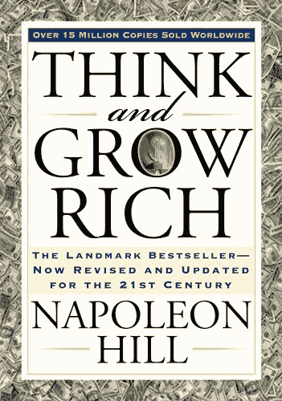
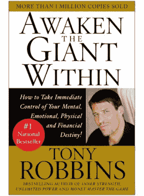
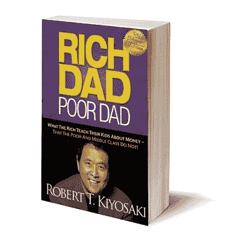
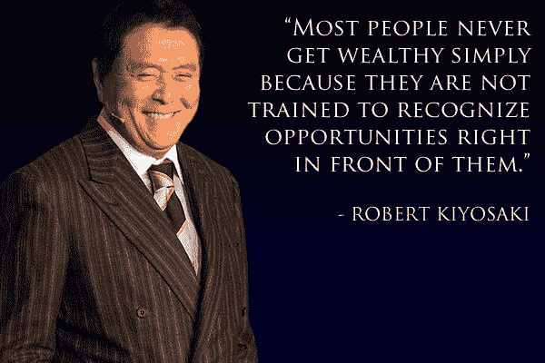
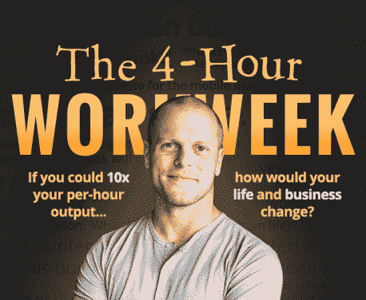
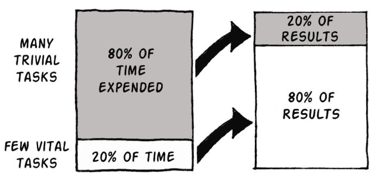
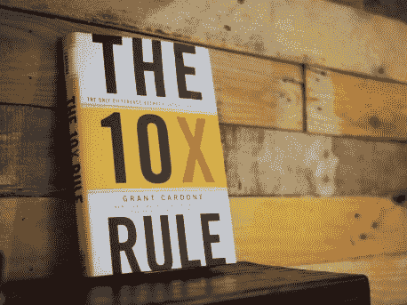

# 如果你想变得富有，读这 5 本书吧！

> 原文：<http://manlymenblog.com/2019/02/08/read-these-5-books-if-you-want-to-be-successful-in-life/>

# 5 本将帮助你获得人生成功的书！

你想让你的生活变得成功，但你不知道如何去做？如果你想在生活中领先一步并取得成功，这篇文章将会非常适合你！

你不再需要嫉妒或被成功人士吓倒。为什么不呢？因为你&只有你拥有自己成功的力量。有了正确的技能和知识，你也能把你的游戏带到下一个层次。

在本帖中，我将仔细阅读 5 本书，它们将教会你改变生活所需的一切。你准备好开始了吗？

## **思考致富**

**[思考致富](https://www.amazon.com/gp/product/1585424331/ref=as_li_tl?ie=UTF8&camp=1789&creative=9325&creativeASIN=1585424331&linkCode=as2&tag=manlymenblo06-20&linkId=c4c2ff799a008725b169315a70e9140e)** 是 [**拿破伦希尔**](https://en.wikipedia.org/wiki/Napoleon_Hill) 写的一本伟大的自强书。他在对许多成功人士进行了 20 多年的研究后，于 1937 年写下了这本书。到现在为止，全世界已经卖出了一亿多张！

思考并变得富有就是在生活中获得财富。当他谈到财富时，他不仅仅指财务。他也指生活的精神和健康方面。

在研究了成功者的习惯后，他确定了成功的 13 条原则。这些原则是:

1.  ***欲望*** :一切成就的转折点
2.  ***信仰*** :观想并相信欲望的达成
3.  *:影响潜意识的媒介*
4.  ****专业知识*** :亲身经历的观察*
5.  ****想象*** :心灵的作坊*
6.  ****有组织的策划*** :将愿望转化为行动的结晶*
7.  ****决定*** :拖延症的掌握*
8.  ****坚持*** :诱导信仰所必需的持续努力*
9.  ****主宰心灵的力量*** :驱动力*
10.  ****性嬗变的奥秘****
11.  ****潜意识*** :承上启下*
12.  ****大脑*** :思想的广播接收站*
13.  ****第六感*** :智慧殿堂的大门*

*

根据拿破仑·希尔的观点，要想致富，你必须让自己处于正确的心态。你不得不认为自己很富有。在他的书中，他将告诉你如何**控制你的思想和想法**以获得成功。他通过打破人们在试图获得成功时所面临的**心理障碍来做到这一点。**

> 在任何人的一生中成功到来之前，他肯定会遇到许多暂时的挫折，也许还会有一些失败。当一个人被打败时，最容易也是最合理的做法就是放弃。这正是大多数男人所做的。这个国家有史以来 500 多名最成功的人说，他们最大的成功离失败仅一步之遥。
> 
> Napoleon Hill

相关帖子:[你仍然破产的 6 个原因](http://manlymenblog.com/2020/12/22/6-reasons-why-youre-still-broke/)

## **唤醒内心的巨人**

如果有一本书能让你完全掌控自己的生活，那就是托尼·罗宾斯的**。在他的畅销书中，他告诉你如何立即掌控自己的精神、情感、身体和财务命运。只有当你在各个方面都表现出色时，你才能成为最好的自己。**

 **我绝对喜欢托尼做的一切，因为他充满激情。托尼·罗宾斯真的是自助大师。他的书让我对自己的行为有了深刻的认识。更重要的是，他让我意识到我是如何破坏自己的成功的。多亏了托尼，我对自己的日常决策和习惯有了更多的了解。我知道每天我都要为创造自己的幸福负责。

> 塑造我们生活的不是我们偶尔做的事情，而是我们持续做的事情
> 
> Tony Robbins

如果你想要一个循序渐进的程序来教你自我掌握的基本原理，那么 **[唤醒巨人](https://www.amazon.com/gp/product/0671791540/ref=as_li_tl?ie=UTF8&camp=1789&creative=9325&creativeASIN=0671791540&linkCode=as2&tag=manlymenblo06-20&linkId=1f546cf05a19b231cfb50a8d47e5d297)** 非常适合你。它会让你发现你真正的目标，塑造你的命运，掌控你的生活。

## **富爸爸穷爸爸**

如果你想掌控自己的财务未来，我真的可以推荐 **[富爸爸穷爸爸](https://www.amazon.com/gp/product/1612680178/ref=as_li_tl?ie=UTF8&camp=1789&creative=9325&creativeASIN=1612680178&linkCode=as2&tag=manlymenblo06-20&linkId=0ed4e3bd25543ba1abdcfb420d1f7afc)** 作者 [**罗伯特 t .清崎**](https://nl.wikipedia.org/wiki/Robert_Kiyosaki) 。

为什么？

当我读它的时候，它真的让我大开眼界，它永远改变了我看待金钱的方式。他让我意识到，和大多数人一样，我在财务方面做错了什么。如果我想要一个真正的致富机会，我知道我必须改变我的方法。提示:停止做其他人正在做的事情！

> 人们在财务上挣扎的主要原因是因为他们在学校呆了几年，但是却没有学到任何关于金钱的知识。结果是，人们学会了为钱而工作……却从未学会如何让钱为他们工作。
> 
> Robert Kiyosaki

罗伯特·清崎将在他的书中告诉你富人教给孩子的、穷人和中产阶级所没有的关于金钱的知识！小时候，他和两个父亲一起长大:一个是富人，一个是穷人。由于这种独特的情况，罗伯特很快发现他们看待生活的方式是多么的不同。更重要的是，他们如何看待金钱。通过写这本书，他把这些“**富爸爸课程**”提供给每一个愿意学习它们的人。

别担心，就像我一样，你不必成为一个金融大师。这本书很容易阅读。他以每个人都能理解的方式写作。

这本书会教你什么:

*   他挑战了你需要一份高收入的工作才能变得富有的信念。
*   他告诉你积累资产的重要性，以及为什么对你的未来来说，积累资产比高薪更重要
*   他质疑你的房子是一种资产的观点
*   他提醒你，为什么你不能指望学校系统教我们的孩子钱，为什么这一技能比以往任何时候都更重要。
*   他解释了应该教你的孩子什么，让他们为生活中的挑战和机遇做好准备。

**[【富爸爸穷爸爸】](https://www.amazon.com/gp/product/1612680178/ref=as_li_tl?ie=UTF8&camp=1789&creative=9325&creativeASIN=1612680178&linkCode=as2&tag=manlymenblo06-20&linkId=0ed4e3bd25543ba1abdcfb420d1f7afc)** 是有史以来排名第一的个人理财书籍！

**[在这里下载你的免费电子书](https://mailchi.mp/896b52eba5bd/manly-men-blog-e-book)**

## **每周 4 小时工作制**

你想提前退休吗？你想要一周只工作 4 小时的生活吗？如果是这样，那么[**蒂莫西·费里斯**](https://fourhourworkweek.com/) 的 4 小时工作周是最适合你的！

一开始我以为又是一本“如何快速致富”的书。毕竟，这听起来好得令人难以置信，对吗？但是读了几章之后，我必须承认我错了。蒂姆·费里斯真的知道他在说什么，这本书里有很多创造你想要的生活方式的好建议。

除了坐在办公室隔间里做朝九晚五的工作，生活中还有更多。如果你真的想尽快逃离激烈的竞争 ，蒂姆·费里斯会给你一些很好的建议。

这本书是关于**有效和高效**的。重要的是你要学会如何让时间为你服务，而不是相反。蒂姆·费里斯利用**的帕累托原则**，也就是通常所说的 80-20 原则来做这件事。如果你想变得更有效率，你必须把注意力集中在能给你带来最好结果的 20%的事情上，而忽略那 80%的事情。

总结:蒂姆·费里斯和他的四小时工作制改变了我对生活的看法。多亏了蒂姆，我的生活变得更好了。

## **10X 法则**

我已经在以前的帖子中告诉过你**格兰特卡尔多内**的[**10X 法则**](https://grantcardone.idevaffiliate.com/1808-6.html) ，所以我不会在这本神奇的书上多写 2000 字来烦你。

我确实想在这里再提一下，因为这本书改变了我的生活。我也希望你有机会改变你的生活！

[**上一篇:如何逃离**的老鼠赛跑](http://manlymenblog.com/2018/11/30/how-to-escape-the-rat-race/)

[**上一篇:如何将你的生活、你的事业&你的收入**](http://manlymenblog.com/2018/12/13/how-to-10x-your-life/)

如果你想拥有成功的人生，遵循**[**10X 法则**](https://grantcardone.idevaffiliate.com/1808-6.html) 才是正道。不要只相信我的话。看下面视频其他人怎么说！**

 **[https://www.youtube.com/embed/C4RMoV2b3eg?version=3&rel=1&showsearch=0&showinfo=1&iv_load_policy=1&fs=1&hl=en-US&autohide=2&wmode=transparent](https://www.youtube.com/embed/C4RMoV2b3eg?version=3&rel=1&showsearch=0&showinfo=1&iv_load_policy=1&fs=1&hl=en-US&autohide=2&wmode=transparent) 

在下面的视频中，你会发现这本书的动画摘要。去之前一定要检查一下！

 [https://www.youtube.com/embed/pV7GhfDtO4E?version=3&rel=1&showsearch=0&showinfo=1&iv_load_policy=1&fs=1&hl=en-US&autohide=2&wmode=transparent](https://www.youtube.com/embed/pV7GhfDtO4E?version=3&rel=1&showsearch=0&showinfo=1&iv_load_policy=1&fs=1&hl=en-US&autohide=2&wmode=transparent) 

[在这里下载你的免费电子书](https://mailchi.mp/896b52eba5bd/manly-men-blog-e-book)*****