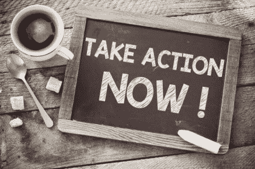

# 成功人士的 11 个日常习惯

> 原文：<http://manlymenblog.com/2019/07/15/11-daily-habits-of-highly-successful-people/>

# 成功者的习惯

你如何变得成功？为什么有些人在生活中非常成功，而有些人却……不是。仅仅是运气吗？恕我不能苟同。

是的，在通往成功的道路上，运气可能以这样或那样的方式发挥作用。但大多数时候，运气是你自己创造的。成功的人“很幸运”,因为他做了所有正确的事情。没有一夜成功这回事。

成功与运气无关。你掌握着自己成功的力量。在你自己身上，你已经拥有了成长所需的一切，也许你并没有意识到这一点。知道这一点是第一步:所以现在就开始为你的成功、你的行动和你的生活负责。

让人们成功的是培养正确的习惯。你的行为是一切的关键。成功人士之所以有今天，是因为他们的习惯。所以从今天开始，开始培养你的习惯。最重要的是，停止破坏你自己！

## 什么是成功？

要想成功，你首先需要给自己定义成功。对你来说成功是什么？成功可以意味着很多不同的事情。

正如你所看到的，有男子气概的人的博客不是围绕一个主题。那是因为成功对每个人来说都是不同的。无论你的目标是赚很多钱，拥有完美的海滩身材，遇见你的梦中情人，做一个好父亲，..这个博客将涉及你生活的每个方面。幸运的是，无论你的目标是什么，成功的原则总是一样的。

成功对任何人来说都有不同的意义:

*   快乐
*   拥有良好的人际关系
*   保持健康
*   做一个好人
*   拥有美满的婚姻
*   掌控你自己和你的生活
*   自由
*   富有
*   拥有一栋房子
*   拥有一辆昂贵的汽车
*   有重要的工作
*   拥有很大的权力
*   做一个好父母
*   有成功的孩子
*   财务安全
*   拥有自己的事业
*   [逃离激烈的竞争](http://manlymenblog.com/2018/11/30/how-to-escape-the-rat-race/)
*   …以及更多

## 专注并优先考虑

成功的人总是专注的。设定你的目标，并据此制定你的计划。要想成功，你必须总是考虑大局，不要让小事分散你的注意力。

保持事情的轻重缓急..养成将注意力集中在最终目标上的习惯。这个世界充满了干扰。做那些不能让你更接近目标的事情，很容易迷失。

成功的关键不是更努力地工作，而是更聪明地工作。专注于给你带来最佳结果和进步的行动。否则你会同时做一千件事情。是的，你努力工作了很长时间，但是没有取得任何进展。不要忙。富有成效。决定什么重要，什么不重要。然后明智地使用你的时间，总是先做重要的事情。

**一直停止多任务**。尽管你觉得你做得更多，但这很少是真的。冲刺阶段的工作。这意味着你应该专注于一项任务，直到完成为止。然后继续下一个任务。

通常回报最大的任务是最难的。你完成这些艰难任务的能力会让你与众不同。这才是真正的进步。**不要选择阻力最小的路径**。舒适区什么也长不出来！

## 设定你的目标并写下来

你的目标是什么？你真正想实现的是什么？

不要小看这部分。决定你到底想要什么，并写下来。写下来是非常重要的一步。所有成功的人都是极度目标导向的。他们清楚地知道自己想要什么，并把它写了下来。

通过写下来，你为自己做了一个非常明智的决定。如果你不这样做，你会很容易让自己摆脱困境。**没有写下来的目标只是一个愿望**。可悲的是，愿望不会实现。

让你的目标成为一种需要，而不是一种渴望。不要再想“如果……就好了”这样的话。这样就永远不会发生了。“这是我想要的，这是我将实现的”是你应该思考的方式。

你的目标应该是具体的、可衡量的。如果可能的话，你可以把你的大目标分成更小的目标来跟踪你的进展。

相关帖子:[如何让你的生活、你的事业&你的收入](http://manlymenblog.com/2018/12/13/how-to-10x-your-life/)

## 制定计划和组织

现在你知道你的目标是什么了，想想要达到目标需要什么。为了实现这个目标，你需要采取什么行动？

再说一遍，把一切都写下来！使**不可取消**。列出需要采取的行动，并计划好何时执行。合理安排你的时间，把最重要的任务放在第一位。久而久之，相应地调整你的任务清单。

时间管理非常重要，因为它会让你最有效率。这会给你最快和最好的结果。

当你把所有的事情都写下来了，你会让自己更难找到借口，失去动力。如果你的一天没有事先计划好，很容易偏离轨道。虽然你不能计划你生命中将要发生的一切。至少，当你有了计划，你可以明智地适应不可预见的情况。

## 采取行动

没有行动，你的目标和计划就什么都不是。每天你都应该朝着你的目标采取行动。你需要养成持续采取行动的习惯。成功的一大关键是完成任务的能力。

如果你没有采取足够的行动，你有多少天赋都没用。不如你有天赋的人会抢先你一步。 ***努力每次都战胜天赋！***

所以克服你的拖延症，现在就开始行动吧。不要让恐惧或其他借口阻止你朝着目标采取行动。**如果你知道自己做得不够，就要对自己诚实。**

为了达到你的目标，你需要积极主动。不要等待成功的到来。下定决心去创造。这样，你将永远比别人领先一步。

> 一英寸的移动比一英里的意图更能让你接近目标。

通常，你应该在准备好之前就行动。为了建立一些东西，行动应该是你的首要行为。是的，计划和思考事情仍然很重要。但是很容易走极端，陷入自己的头脑中。**过度思考可能会适得其反**。如果你花太多时间思考而不是做，你就会失败。是时候采取一种“**我以后再想办法**的态度了。

你不必一开始就计划好所有的事情。不要让你的想法阻止你采取行动。如果你继续计划，你甚至可能还没有开始！

相关帖子:[你仍然破产的 6 个原因](http://manlymenblog.com/2020/12/22/6-reasons-why-youre-still-broke/)

## 停止拖延

如果你想成功，拖延是你的敌人。为为什么你可以以后再做而找借口总是很诱人的。但事实是，你要么永远做不到，要么做得太晚，减缓你的进步。

除此之外，你会失去动力和自豪感。没有人会在推迟某件事情后真正感觉良好。

拖延是一种习惯，意味着你可以忘掉它。为了停止这种行为，你首先必须**找出你现在不行动的借口**。例如:

*   当我有压力时，我工作得更好
*   这项任务太有挑战性/太难了。我过会儿做它
*   我太累了。我不会交出我最好的作品
*   我想做些别的事情，我需要放松
*   不需要现在就做。不急
*   我害怕失败
*   …

总有一个**情绪触发器**让你拖延。这会让你感觉更快乐。(我想放松一下)也可能是恐惧造成的。(太难了。我做不到)。

下次你想拖延时，对自己诚实。你现在不想采取正确行动的真正原因是什么？你的借口背后的真实情绪是什么，是真的吗？

*   我真的在压力下工作得更好吗？或者如果我有更多的时间，我的工作会更好吗？
*   这个任务真的太难了吗？如果我不尝试，我怎么知道？我有让自己吃惊过吗？明天会更容易还是更难？
*   我是不是真的太累了，无法交出最好的作品？还是我只是懒？明天我会觉得不那么累吗？我到底需要多少能量？我能从今天开始直到我真的太累了吗？
*   我需要放松。当我知道我没有完成的时候，我真的能够放松和享受吗？或者之后我能放松得多吗？
*   不急。明天会很急吗？这不是我真正想要的吗？
*   我害怕失败。我连试都不试难道不会失败吗？如果我成功了呢？如果我能做到呢？

下次你想放弃自己的时候，问问自己正确的问题。创造正确的心态。开始长期思考。现在就做吧，这样你就不会后悔了。

不要为了短期的满足而选择。追求延迟的满足。为什么？因为奖励会更大。把你现在想要得到某样东西的欲望换成以后拥有更大的东西的快乐。这需要牺牲，但你必须把目光放在奖励上。你每天都要做出许多选择。确保你的选择是明智的，因为好东西总是留给那些耐心等待的人。

## 纪律，学科

为了选择延迟满足，你需要培养纪律性。纪律是控制你的冲动、情绪、欲望和行为的能力。它是能够拒绝眼前的快乐和舒适，而去追求实现你渴望的目标所带来的长期满足感和成就感。

纪律就是一次又一次地做出正确的决定。这意味着你能掌控自己的生活。这意味着让你深思熟虑的选择来控制你的情绪和欲望。

> ***动力让你开始。纪律让你前进***

如果你没有纪律，几乎不可能实现你有能力实现的目标。幸运的是，如果你现在缺乏纪律，这是可以创造的。把纪律看作是你可以随着时间发展的肌肉。

**纪律是通过**一遍又一遍的不断实践而发展起来的。训练它。建造它。让那块肌肉变得更强壮，直到它成为一种习惯。

你约束和控制自己的能力是你作为一个人可以培养的最重要的品质。自律的习惯在生活的各个领域都与成功密切相关。

## 放松

你不可能一直高效。你的生活需要一些乐趣。过多的压力对你有害，应该避免。这就是为什么你需要时不时放松一下。如何让人放松对每个人来说都不一样。但是一定要为它创造时间。

如果你以正确的方式组织你的时间来实现休息时间，它将不会阻碍你的目标。它会帮助你。这将有助于你集中注意力，减轻压力。有时候你需要**刷新你的头脑**和你的身体，以保持**积极的态度**。

另外，如果你计划得当，你就不会在无意义的事情上浪费时间。确保你的休息时间是质量时间。利用这段时间做真正让你开心的事情；花时间和你的孩子或妻子在一起，爱好，锻炼，冥想…只要能让你开心就好！

虽然我的目标是拥有一个非常成功的博客，但我总是把陪伴孩子和妻子的时间放在首位。所以在我休息的时候，我会尽可能多的和他们在一起。

生活已经这么乱，这么忙了。有时候你需要停止担心未来和过去，开始活在当下。那是唯一有意义的时间。生命很短暂，所以开始活在当下。把每一天都当作生命的最后一天来过。

成功人士拥有出色的时间管理技巧。他们不会被无意义的事情分心，也不会浪费时间。

## 永远保持学习

要想在生活中获得成功，你必须不断提高自己。大多数人上学，一旦找到工作就停止学习。但是学校不是教育自己的唯一途径。你的大学学位并不是你教育的终点。

成功人士一生都在不断学习。他们就是这样不断成长的。你必须**接受自己的弱点，并努力克服它们**。这会给你更大的机会在生活中获得成功。

保持学习的一个好方法是读书。阅读是获得知识和智慧的一个好方法。如果你不喜欢阅读，你可以随时听播客或观看研讨会。

当然，如果你想不断进步，你可以去看看男人博客！眨眨眼。

相关帖子:[如果你想成功，读这 5 本书](http://manlymenblog.com/2019/02/08/read-these-5-books-if-you-want-to-be-successful-in-life/)

## 网络

没有人是一座孤岛。你的关系网很重要。有很多人可以用不同的方式帮助你。你不必独自经历这段旅程。

记住**团队合作**中的价值。所以要学会和别人合作。有很多好的想法、建议和智慧可以分享。所以重要的是，你要开始提高你的社交技能，开始建立关系网。帮助别人，做好人。学会用善良、同情和理解与人相处。这让你感觉很好，你永远不知道你可能会得到什么回报。

还有，试着多和成功人士在一起。你会发现他们的想法和行为都不一样。这是一个很好的获得灵感的方式，也是一个让自己适应某些性格特征的方式。

## 关注你的健康

优先考虑你的健康。当你不注意自己的健康时，是不可能取得成功的。你需要高能量水平才能采取必要的行动来达到你的目标。

这意味着你应该注意饮食，定期锻炼。不要低估良好睡眠的重要性。所以不要过于频繁地牺牲睡眠，因为你认为这会让你更接近你的目标。长此以往，只会害了你。

健康的心灵只能存在于健康的身体里，所以要好好呵护它。

## 坚持不懈

我是如何创建男子汉博客的？我一个字一个字地做。就这么简单。

如果你想有所成就，你必须一步一步来，并且持之以恒。最终，你会得到结果。**永不放弃**。相信事情最终会解决，即使你只是在开始阶段。当机会似乎对你不利时，保持自信。如果事情不顺利，不要放弃。一遍又一遍地尝试，但是在必要的时候改变你的方法。

成功不是短跑，而是马拉松。当事情变得艰难时，把你的眼睛放在奖品上。

> ***不退出。现在受苦，作为冠军*** 度过余生
> 
> Muhammad Ali

振作起来，许多成功人士都经历过这一过程。所以，如果你看不到尽头，就像我一样:坚持下去，一次一个字。

希望这篇帖子能在你实现梦想的路上帮到你。不要等待它发生，而是现在就开始！把你的成功放在第一位，并让它发生。我等不及要在另一边见到你了！同时，继续关注博客，不断进步！

<link href="//cdn-images.mailchimp.com/embedcode/horizontal-slim-10_7.css" rel="stylesheet" type="text/css">