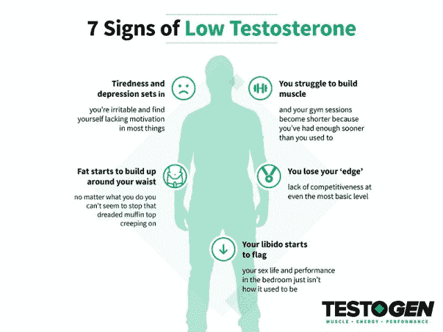

# 你的荷尔蒙水平阻碍了你的肌肉增长吗？

> 原文：<http://manlymenblog.com/2021/10/25/are-your-hormone-levels-holding-back-your-muscle-gains/>

## 练不出任何肌肉？可能是你的荷尔蒙！

直到我们开始注意到我们身体反应方式的一些不同，我们许多人才意识到我们的激素可能产生的影响。只有到那时，我们(可能)才会站起来注意，尤其是如果我们正在努力锻炼肌肉的话。

一个健康的激素系统使我们能够保持身材，完成我们的日常任务以及其间的一切。这包括我们获得肌肉和达到身体目标的能力。

很容易将你所有的努力集中在营养和训练的结合上，毕竟，这似乎是最需要注意的因素。但这往往意味着，在锻炼肌肉时，荷尔蒙被忽视了。

事实上，有几种激素在力量训练中起着重要作用，包括睾酮、生长激素(GH)和胰岛素样生长因子(IGF-1)。这种激素组合可以刺激肌肉生长和力量建设。但这还不是全部。

让我们仔细看看你的荷尔蒙是否阻碍了你的肌肉增长。

## 健美运动中有哪些关键激素？

研究表明，荷尔蒙以不同的方式影响肌肉的生长和力量。虽然有些专门专注于促进肌肉生长，但其他人在身体利用和储存葡萄糖的方式中发挥着重要作用——支持你的训练努力。

正如我们上面提到的，睾丸激素(主要在睾丸中产生的激素)是肌肉质量和力量发展的关键激素之一，也是常见的男性特征，如:

*   [性冲动](http://Finish https://mixi.mn/?a=195850&c=8425&p=r&s2=https://testogen.com/blog/how-to-increase-libido/&ckmrdr=https://testogen.com/blog/how-to-increase-libido/)
*   脂肪分布
*   毛发生长
*   低沉的声音

虽然女性体内的睾丸素含量少得多，但对男性来说，睾丸素相当重要。你可能已经听说过睾酮被称为一种雄性激素和合成代谢类固醇激素，它既指男性特征(雄性激素)，也指身体组织的生长(合成代谢)。

如果你想锻炼肌肉和力量，但感觉你在健身房的努力没有奏效，这可能是因为你的睾丸激素水平。随着年龄的增长，我们的睾丸激素水平逐渐下降是完全自然的。是的，逐渐地。你不应该在一夜之间经历 T 水平的下降——如果你很快注意到显著的变化，最好尽快寻求医疗建议。

一段时间以来，人们一直在寻求合成代谢物的作用。几十年来，健美运动员已经发现潜在致命的合成代谢类固醇有助于刺激肌肉生长。任何形式的睾丸激素在竞技体育中被禁止都不足为奇。

[相关:为什么每个男人都应该举重](http://manlymenblog.com/2018/06/13/this-is-why-every-man-should-lift-weights/)

### 生长激素和 IGF-1

IGF-1 最终负责合成代谢肌肉的生长——它的产生受到生长激素的刺激，生长激素由脑垂体产生。就像睾丸激素一样，随着年龄的增长，生长激素的分泌开始自然下降。

这两种激素在身体脂肪中起着关键作用，这意味着如果你的身体产生较少的生长激素和 IGF-1，你就会积累更多的身体脂肪。

### 胰岛素

很有可能你以前听说过胰岛素。这种储存激素是由胰腺产生的，是对你所吃食物的一种反应。当你吃东西时，你摄入的食物被分解成葡萄糖、脂肪酸、氨基酸、维生素和矿物质。

胰岛素在肌肉和肝脏中储存葡萄糖的储存形式，即糖原。它还能使氨基酸修复受损组织，增加肌肉质量。由于胰岛素的产生在很大程度上受锻炼和饮食(尤其是碳水化合物和蛋白质)的影响，这些影响被认为是合成代谢的。

### 皮质醇

皮质醇或人们常说的“压力荷尔蒙”是由肾上腺产生的。当我们的身体在生理上或情绪上受到压力时，它的释放就会被触发。氢化可的松和可的松都是人工制造的皮质醇。皮质醇是一种分解代谢激素，分解组织。

除此之外，每当血糖低时，皮质醇通过分解肌肉来帮助控制炎症和制造葡萄糖。

### 胰高血糖素

胰高血糖素通过推动肝脏放弃其葡萄糖储存来发挥作用，这可能非常重要，特别是如果你吃得快或遵循低碳水化合物饮食。如果胰岛素是合成代谢的，那么胰高血糖素是分解代谢的。

[在这里下载你的免费电子书](https://mailchi.mp/896b52eba5bd/manly-men-blog-e-book)

## 但是为什么荷尔蒙如此重要呢？

除了支持你的整体健康(甚至你的性欲)，激素在调节你的新陈代谢、控制你能量的反应以及处理你摄入的食物方面发挥着至关重要的作用。

在健身房的一次剧烈运动中(以及运动后)，你的身体会被一系列不同的激素所淹没——要么是合成代谢激素(消耗能量的激素)，要么是分解代谢激素(释放能量的激素)。然而，这些激素的作用只会影响你锻炼时受到刺激的肌肉。

对于肌肉的生长，你需要更多的合成代谢激素而不是分解代谢激素。这些激素包括:

*   胰岛素
*   胰岛素样生长因子
*   生长激素
*   睾酮

[相关:这就是为什么深蹲是所有运动中的王者](http://manlymenblog.com/2019/01/08/the-squat-is-the-king-of-all-exercises/)

## 可以自然增强荷尔蒙吗？

生长激素、IGF-1、睾酮和皮质醇都会对负重训练的强度做出反应，这意味着良好的营养和锻炼可以影响它们的产生。

胰岛素和胰高血糖素也受锻炼和饮食的影响，这通常与合成代谢激素相矛盾。虽然锻炼对自然提高你的激素水平很重要，但是健康的睡眠时间表和锻炼之间的休息也同样重要。

### 运动前后均有良好的营养

你在锻炼前、锻炼中和锻炼后摄入的食物种类会对你的训练产生很大影响。运动前和运动中吃碳水化合物有助于减少皮质醇的增加。

让我们简单地说:当你的血糖供应保持在健康水平时，皮质醇不需要释放，你的肌肉组织也不会被烧毁。

如果你担心低睾丸激素会影响你的肌肉生长，锻炼实际上可以提高你的睾丸激素水平。一旦停止锻炼，睾丸激素就会随着可的松水平的上升而下降。为了减轻这种影响，你需要在运动后摄入蛋白质，以平衡血液中睾酮与可的松的比例。

要提高你的水平，请尝试以下方法:

*   之前:锻炼前 45 分钟，摄入 20 克容易消化的蛋白质
*   锻炼期间:在锻炼期间喝一点运动饮料，尤其是当你锻炼超过一小时的时候
*   之后:锻炼后 30 分钟内，再摄入 20 克蛋白质和大约 40 克碳水化合物

重要的是不仅要考虑你在吃什么，还要考虑什么时候吃。为获得最佳效果，建议:

*   少吃碳水化合物，因为这会增加你的生长激素
*   锻炼前或锻炼过程中摄入碳水化合物以降低皮质醇水平
*   禁食——如果安全地进行，可以提高生长激素水平
*   锻炼后吃蛋白质有助于保持你的 T 水平
*   在剧烈运动后，保持碳水化合物和蛋白质的比例在 3:1 左右
*   保持所有营养均衡

相关:你应该服用睾丸激素增强剂吗？

## 锻炼策略和健康激素——如何最大限度地增加肌肉

高强度的锻炼会提高睾丸激素、生长激素和 IGF-1 的水平，但也会促进皮质醇的飙升。在耐力训练中，试着在两组之间休息 3 到 5 分钟。一旦你的身体有足够的时间恢复，这将刺激 T 的产生并帮助你表现得更好。

这意味着那些渴望锻炼肌肉的人应该在每组之间休息 3 到 5 分钟，而不是常规健身计划中通常建议的 1 到 2 分钟。

睡眠也很重要！你应该总是努力获得良好的夜间休息，并坚持睡眠时间表，因为你不仅会感到休息良好，准备好去健身房，而且你的生长激素水平在深度睡眠期间会得到刺激。

## 用睾酮自然安全地提高你的睾酮水平

寻找一种方法来提高你在健身房的表现，促进肌肉生长？如果你正在努力增肥，这可能是由于你的睾丸激素水平。每天只需 4 粒胶囊， [Testogen](https://mixi.mn/?a=195850&c=8425&p=r) 就能自然安全地提高你的睾酮水平，逆转睾酮水平低下的症状。

100%安全和天然成分，Testogen 提供改善的能量水平，增强的性能，肌肉生长和脂肪减少。现在，去打破锻炼！

### 用 Testogen 捆绑包省钱

睾酮自然提高你的睾酮，逆转睾酮水平低的症状。所以你每天都会感觉更好。现在，如果你[订购两瓶 Testogen](https://testogen.com/) ，你将获得第三瓶绝对免费！

*   男性健康和福祉的完整睾丸激素支持
*   临床研究支持的 100%安全天然成分
*   每天只需 4 粒胶囊就能安全地提高你的睾丸激素水平
*   提高能量、性能、肌肉生长、性欲和减脂

<link href="//cdn-images.mailchimp.com/embedcode/horizontal-slim-10_7.css" rel="stylesheet" type="text/css">