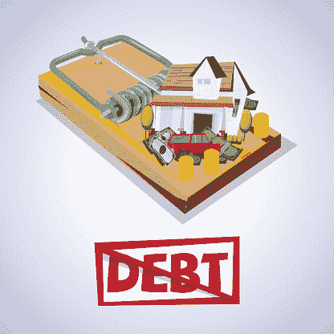
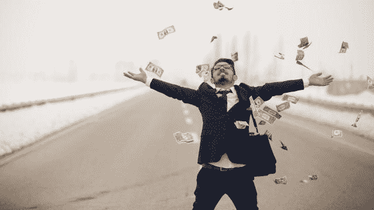
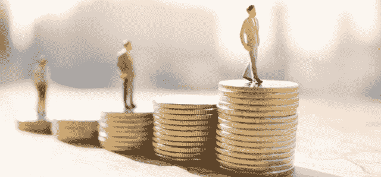
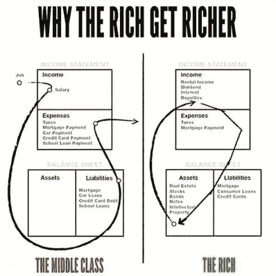
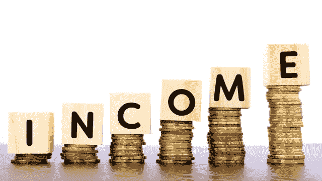
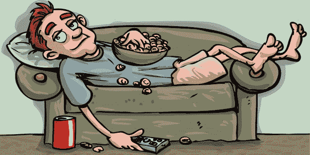

# 你仍然破产的 6 个原因

> 原文：<http://manlymenblog.com/2020/12/22/6-reasons-why-youre-still-broke/>

## 你仍然破产的 6 个原因

月底你几乎没有现金了吗？你发现收支平衡很难吗？如果答案是肯定的，要非常小心。破产可能是暂时的事情，但如果你不修复破产的原因，它很容易导致贫困。

如果你厌倦了总是破产，现在就去解决它吧！在这篇文章中，你会发现人们为什么会停留在这种不受欢迎的情况下。更重要的是，找出你能做些什么。

### 1.你的债务太多了

破产的一个主要原因是债务。过多的债务会使你的财务状况受到威胁，并使改善你的状况变得不可能。

如果你收入的很大一部分用于支付每月贷款，你就没有钱可以存了。更糟糕的是，你将没有剩余的钱来支付每月的开销和需求。这是一条非常危险的道路。很快你将会借额外的贷款来支付第一笔利率极高的贷款。欢迎来到完全的金融灾难。

解决办法？不要入不敷出。如果你总是买你不需要(也买不起)的东西，很快你就买不起你确实需要的东西了。所以，停止花掉你所有的收入(或更多)。下次你想买东西的时候，问问自己:我真的需要买这个吗？

停止做冲动的决定，而是开始计划和储蓄。花点时间对你的收入、月支出和债务做一个财务概述。接下来，制定一个预算来优先偿还你的债务。

### 2.你的生活方式太昂贵了

如今，消费主义是常态。大部分人，尤其是年轻人，都想要，而且要快！他们都想要漂亮的新手机、昂贵的汽车和漂亮的房子……虽然想拥有美好的东西没有错，但经常陷入这种消费主义陷阱不是最明智的举动，会让你破产。

确保你的钱包能匹配你想要的奢侈品。摆脱那种权利感。这个世界不欠你任何东西。如果你想要什么，从小处着手，为之努力，为之计划并赢得它。不要与邻居攀比。面对现实吧，一旦事情败露，邻居是不会帮你的！

如果你想在财务上有所增长，你需要能够明智地储蓄和投资。如果月底没有剩余的钱，你就不能这样做。从长远来看，你过度消费的习惯正在扼杀你的财务增长。

从现在开始，驯服你的消费欲望。为消费、储蓄和投资制定预算。如果你将此作为优先事项，很快你就会享受到延迟满足的奇迹。

### 3.你不是在储蓄和投资

一旦你控制了自己的消费习惯，你就可以开始集中精力存钱了。有两种方法可以省钱，其中只有一种会让你变得富有。

*   省钱就是省钱

*   存钱投资

与许多大师告诉你的相反，你不能靠储蓄致富。仅仅把你每天在星巴克喝的拿铁咖啡存进你的 401K 账户不会让你变得富有。另外，你不想只有老了退休了才有钱，对吧？

生活中有两种方法可以致富。你可以走快车道或慢车道。所以下定决心吧。如果你对你的钱很认真，并且想了解更多关于快车道的知识，我强烈推荐你阅读 MJ·德马科的《百万富翁浪子》。尽管书名选得很糟糕，但这本书充满了实用和现实的建议，告诉你如何在衰老和满脸皱纹之前变得富有。

当你破产的时候，找到削减日常开支的方法是很棒的。节省的钱可以加起来。但是更重要的是你如何使用你省下的钱。削减开支的目的是把钱用在更好的事情上。正如你在这篇关于[企业家](https://www.entrepreneur.com/article/320655)的文章中读到的，“为了投资而储蓄，不要为了储蓄而储蓄。”你永远也不会用你的钱去防守而变得富有。

为了进行正确的投资，你还需要具备财务知识。你要知道[资产和](https://www.richdad.com/what-are-assets-and-liabilities)负债的区别。

应急基金怎么样？生活充满了不愉快的惊喜和意想不到的代价。所以，是的，留出一些钱来保护你免受这些紧急情况的影响是很重要的。这将避免破产或不得不借钱。

### 4.你的收入不够

但是，如果我所有的收入都用来支付每月的开销和成本，我该如何存钱投资呢？破产的原因可能不是你的支出，而是你没有收入。

是的，降低支出很重要，但你只能削减这么多成本。虽然减少你的月供是有限度的，但是增加你的收入是没有限度的。

如果你靠薪水过活，却没有机会存下任何钱，那么你很难在财务上有所进展。所以，如果你是这种情况，开始探索你的选择:

1.  找一份新的薪水更高的工作
2.  获得可以利用的更好的技能和知识。
3.  在目前的工作岗位上加班或找第二份工作(不建议，因为税收和投入的时间奖励太少)
4.  全职或兼职创业。
5.  在目前的工作岗位上要求加薪
6.  创造被动收入

如果你在寻找更多关于如何摆脱靠薪水过活的建议，并获得更多合适的收入，请务必阅读以下文章:[如何逃离激烈的竞争](http://manlymenblog.com/2018/11/30/how-to-escape-the-rat-race/)。

在这里下载你的免费电子书。

### 5.你太懒了

积累财富没有捷径。有很多快速致富的计划，但没有一个真正有效。你会发现努力(和聪明)是无可替代的！)工作。所以如果你很懒，总是寻找捷径，现在就放弃吧。因为这花了你很多钱。

不要等待财务自由奇迹般地来到你身边。马上行动起来，去得到它！要明白积累财富是一个渐进的过程，首先需要付出很多努力。你必须投入时间和精力。

如果你梦想着你的兼职成为一份全职工作，那么你除了正常工作之外的时间应该得到有效利用。

不要太轻易放弃，因为财富只留给坚持不懈的人。你会被一次又一次的考验。会有很多失败和挣扎。但是无论你做什么，不要放弃自己。斗争是过程的一部分。

大多数一夜之间的成功实际上需要大量的时间和努力。所以证明自己的价值，扔掉借口，去做吧。不要像大多数人一样抱有希望。相反，对你的处境和你的成功(或缺乏)负责。

开始创造，而不是消费。为什么你在电视上看不到兰博基尼的广告？因为买得起的人，不会浪费时间看电视。这就是原因。他们忙于过自己的生活，而不是作为别人生活的旁观者。

如果你想在生活中采取更多行动，请阅读这篇关于如何 10 倍、你的生活、你的事业和你的收入的文章。

### 6.你和错误的人混在一起

他们说你变得就像那 5 个和你相处最多的人一样。“给我看你的朋友，我就给你看你的未来。”所以，如果你想获得经济上的成功，就和那些经济上成功的人交往吧。只有这样，你才能了解他们的思维方式和做事方式有什么不同。

我不是说要抛弃你所有的朋友。我只是建议你多关心一下你大部分时间和谁在一起。有些人真的很好相处和放松。向他人学习和提升自己是很好的选择。

试着和那些和你有同样动力和抱负的人在一起，推动你做得更好。另外，每个人都应该至少有一个榜样或导师，他就在你生活中想去的地方。

也要非常小心你从谁那里得到建议。如果你想得到商业方面的建议，去问一个成功的企业主。如果你想在经济上变得更好，不要接受一个懒惰和破产的沙发土豆的建议。

最后一个建议:远离消极的人。他们只会一次又一次地消耗你的能量。

我真诚地希望这篇文章对你有所帮助，并祝你在追求财务成功的过程中一切顺利。如果你现在破产了，相信你仍然可以扭转局面。

如果你喜欢这篇文章，一定要在下面订阅。还有更多的要来…

<link href="//cdn-images.mailchimp.com/embedcode/horizontal-slim-10_7.css" rel="stylesheet" type="text/css">

[在这里下载你的免费电子书](https://mailchi.mp/896b52eba5bd/manly-men-blog-e-book)