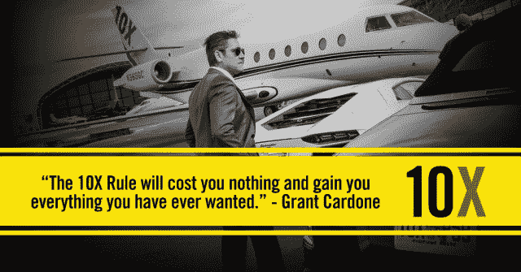
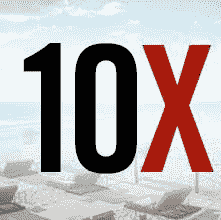
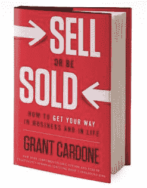
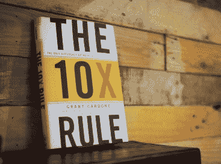
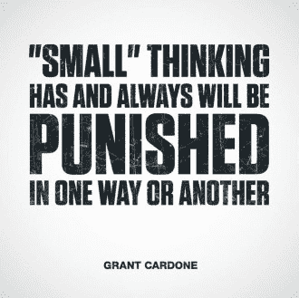
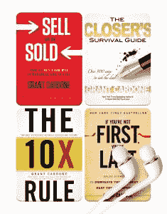
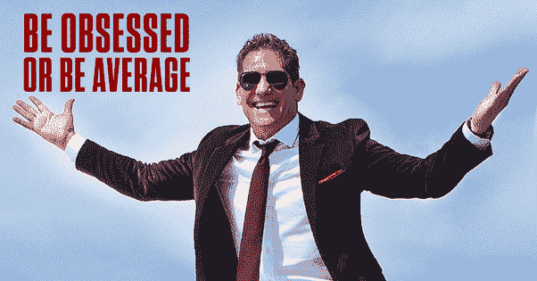
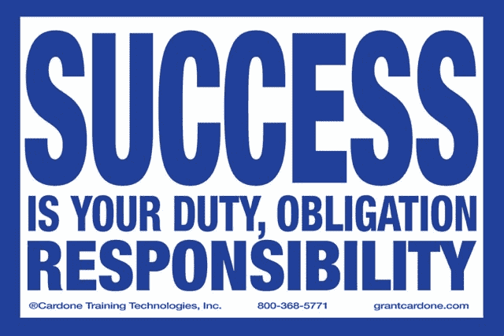

# 如何将你的生活、事业和收入提高 10 倍

> 原文：<http://manlymenblog.com/2018/12/13/how-to-10x-your-life/>

# 10X 法则:成功与失败的唯一区别

你想变得比一般人更优秀吗？你希望你的生活比“还行”更好吗？你想成为一个胜利者，呼吸成功吗？

然后，是时候**停止瞄准平均**了。开始构建你真正渴望的生活，不要再满足于现状。现在就学习如何运用**[10X 法则](https://grantcardone.idevaffiliate.com/1808-6-1-30.html)** 来改变你的生活吧！这篇文章将告诉你如何做。

> 向月亮射击。即使你错过了，你也会在群星中着陆。

## 格兰特·卡尔多内的 10X 法则

### 格兰特·卡尔多内是谁？

我这篇文章是基于畅销书“**[10X 法则](https://grantcardone.idevaffiliate.com/1808-6-1-30.html)**—*失败和成功的唯一区别。*”作者: **[格兰特·卡尔多内](https://www.entrepreneur.com/author/grant-cardone)** ，作家、国际演说家、商业创新者、世界第一销售培训师、社交媒体名人。

当我第一次在 youtube 视频中看到他时，我觉得他有点自大，有点自以为是。但是就像生活中的许多美好事物一样，格兰特是一种后天习得的品味。我没有把他放在盒子里，而是给他打了一针，看了几个采访和视频。

事实证明，格兰特实际上是一个非常有趣和谦逊的人，一旦你开始“了解”他。现在我爱死这家伙了！此外，他很聪明，他真的知道他的东西。所以不要太早放弃他。总会有比看上去更多的东西。

格兰特 10 岁时，他的父亲因心脏病发作去世。他不得不在没有父亲指导的情况下成长。正因为如此，他的青少年时期和成年初期非常麻烦。他在高中被贴上了“失控”的标签。放学后，他让自己**染上毒瘾**和**酗酒**。他的生活失去了控制，连工作都保不住。

在失去他的兄弟后，他的生活和毒瘾变得更糟了。他妈妈不想再和他有任何关系了。格兰特终于受够了，把自己送进了康复中心。

格兰特·卡尔多内在经济上和情感上都已经破产了。他没有方向，对社会和家庭都是个问题。

在中心，他终于意识到**生活不是关于过去的**。**它关乎现在，也关乎创造未来**。格兰特终于做出了决定。

他突然戒掉了毒品。他拿出全部精力，100 %地投入到工作中。尽管他讨厌自己的工作，但他决定要成为有史以来最伟大的推销员。他每天起早贪黑。他学到了他需要知道的关于销售的一切。

不久，他开始了自己的第一笔生意，销售他开发的多种销售程序。他的项目影响了成千上万的销售人员。

其余都是历史。现在，他是世界上排名第一的销售和营销培训师，他是七本销售和商业书籍的作者，其中包括纽约时报畅销书《如果你不是第一名，你就是最后一名》和公理奖获得者《销售或被销售》。

出售或被出售:看看吧！

### **10X 法则**

我非常喜欢这本书。**[10X 法则](https://grantcardone.idevaffiliate.com/1808-6-1-30.html)** 对我来说是一个不可思议的灵感。多亏了 10X 法则，我开始为自己和家人设定目标。我开始更好地利用我的时间。我开始成就更多，梦想更大。

和**这个博客**就在这里？虽然它还远未达到其全部潜力，但如果没有 10 倍法则，它可能甚至不会存在。

在**[10X 法则](https://grantcardone.idevaffiliate.com/1808-6-1-30.html)** 中，他会引导你**正确的心态才能成功**。无论你想在事业、家庭还是生活中获得成功。你可以将 10 倍法则应用到生活的任何领域。格兰特认为，为了取得成功，你需要设定比你认为能达到的目标大 10 倍的目标。
运用 10 倍法则，你将**得到你最初的目标并乘以 10** 。

现在看看你为实现目标会采取的**行动和努力**。现在**将这些动作乘以 10** 。要想成功，你必须采取比你认为必要的行动大 10 倍的行动**。采取大规模行动是实现你真正潜力的唯一途径。**

信不信由你，但是没有一夜成功这回事。在任何领域取得成功的人都以这样或那样的方式使用过 10x 原则。

### **设定 10X 目标**

根据**[10X 法则](https://grantcardone.idevaffiliate.com/1808-6-1-30.html)** ，你应该为自己设定**目标**，比你相信自己能达到的目标**大 10X**。如果你想成为你能成为的人，发挥你的全部潜力，你必须把标准定得更高。

要想成功，最重要的是要有正确的目标。可悲的是，这是许多人已经失败的地方。他们设定了错误的目标，过于模糊甚至更糟的目标，不够刺激的目标。

**小目标无新意**。它们看起来更容易完成，但是它们不会给你太多的满足感。平均目标导致平均结果。一个小目标不足以激励你，你会让自己表现不佳。
因为比起更大的目标，它们带给你的满足感会更少，所以退出和放弃会更容易**。** 

[授予卡顿核心 Mp3 包](https://grantcardone.idevaffiliate.com/idevaffiliate.php?id=1808&url=5878)

**开始往大处想**设定大目标！要想做大，先问自己这些问题:

*   你认为你有潜力取得比现在更多的成绩吗？
*   在商业和生活中，你有能力做更多的事情或获得更多的结果吗？
*   如果金钱不是目标，你最想拥有的三样东西是什么？
*   除了你现在做的事情，你还想做什么来谋生？
*   今年你想结识的 10 个人是谁？谁会改变你的人生方向？你打算如何联系他们？
*   你对未来有财务计划吗？还是只有一个预算？
*   在你的生活中，有哪些领域你不是 100%全身心投入的？
*   在你的生活中，有没有人用消极和有限的思维拖你的后腿？
*   今年必须发生的三件事是什么？

这是那种会启发你的想法。它会激励你采取大规模的行动，尝试新事物！

永远不要沉淀，不要怀疑自己！你比你想象的更有潜力。你还能做得更多。

但是如果我制定了一个大目标却失败了呢？这么看吧。如果你最初的目标是赚 10 万美元。你的 10 倍目标是赚 100 万美元。如果你不得不放弃，你希望是哪个目标？如你所见，如果你不得不失败，在大的事情上失败总是更好。你可能会取得更多的成就。

### **10X 动作**

所以你已经把思维调整到了梦想远大。现在是时候调整你的行动了。

大规模成功的秘诀是**大规模行动**。你必须付出比大多数人多 10 倍的努力。人们几乎总是**低估完成一件事所需要的行动和努力。10 倍乍一看似乎太多了，但过早达到目标总比达不到好。** 

人们往往低估了在实现预期目标之前他们将面临的逆境和障碍的数量。事情总会出错。总会有**障碍**。你应该预料到它们，并采取大规模的行动来克服它们。

接受事情需要更长时间才能完成的心态。然后尽可能地为这些事情做好计划。

**做别人不愿意做的事情**。大多数人都不愿意把自己的努力乘以 10。如果你在一个没有人愿意采取的水平上采取立即、一致和持续的行动，它将允许你上升到顶端。

拒绝墨守成规:永远不要按照别人公认的标准行事。创新不会以这种方式发生。

> 永远不要降低你的目标。总是增加动作。
> 
> 通常当事情没有按计划进行时，人们做的第一件事就是降低目标。这是通往成功的错误道路。只要加大努力，多行动。对自己诚实你会发现你可以做得更多。
> 
> Grant Cardone

学会过度承诺。它将迫使你以 10 倍的水平运营，以兑现你的承诺。当你过度承诺时，你就会面临问题。但是，通过坚持不懈的高水平行动，你会取得惊人的成果。**先犯，后图其余！一旦你获得了成功，并不意味着你已经成功了，不再需要采取行动。你必须保持你的成功。在遵循 10X 法则** 的同时，不断地将标杆抬高。

### **4 度动作**

您可以使用 4 种不同程度的动作:

1.  **什么都不做**
2.  **撤退**
3.  **正常行动水平**
4.  **大规模行动**

在《10X 规则》中，格兰特·卡尔多内将详细讲述这一点。当然，成功的唯一道路是#4 大规模行动。但是**你怎么知道**你正在采取大规模行动？

当你在第四级动作时，你的心态会改变，你的结果也会改变。这对你来说不再是不寻常的，但它会成为一种习惯。当你开始收到来自家人、朋友、同事……的评论时，你会知道你在第 4 层工作。因为人们会觉得这很奇怪，他们喜欢现状。

> “你从不放弃，是吗？”“你被迷住了”“你很快就会精疲力尽”“你从不休息吗？”“你嗑什么药了？”你为什么要这么做？”“什么时候够了？

人们会回应你，因为你的行为超出了公认的社会活动规范。

[**相关帖子:想成功就看这 5 本书！**](http://manlymenblog.com/2019/02/08/read-these-5-books-if-you-want-to-be-successful-in-life/)

### 成功是你的义务。

成功很重要

成功是你的责任和义务

不乏成功。

对自己的人生负责。停止责怪政府，你的老板，你的父母，你的配偶，你的孩子，…

无论你在生活中是赢是输，那都是你的决定。你是司机，你决定生活将带你去哪里。

如果你认为成功不重要，你永远不会成功。获得成功并发挥你的潜力是你的责任。

你欠每一个依靠你成为**最好的自己的人**。成功不应该是你的选择，而是你必须履行的义务。

不乏成功。你要成功，并不意味着其他人也要失败。停止那种局限思维。

你认为成功重要吗？

你准备好让成功成为你的义务了吗？

你觉得自己很普通吗？还是你已经准备好**10 倍于你的人生**并最终发挥你的潜力？

如果你真的想改变你的生活、生意或收入，那就开始行动吧:

<link href="//cdn-images.mailchimp.com/embedcode/horizontal-slim-10_7.css" rel="stylesheet" type="text/css">  

[**相关帖子:如何逃离老鼠赛跑&开始人生赢家**](http://manlymenblog.com/2018/11/30/how-to-escape-the-rat-race/)

[下载你的免费电子书](https://mailchi.mp/896b52eba5bd/manly-men-blog-e-book)