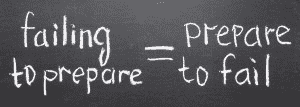

# 获得你梦想中的工作:如何搞定面试

> 原文：<http://manlymenblog.com/2018/03/12/how-to-nail-that-job-interview/>

# 做个好人，让他们无法忽视你！

成为说服大师。学会如何推销自己，接受理想的工作。如果你要去参加一个工作面试，你会想毁掉它。如果你不这样做，别人会抢先你一步。在本文中，您将学习如何掌握主动权并达成交易！

那么，你想在下一次面试中表现出色吗？

***这里有一些帮助你成功的重要提示:***

# 1.准备是关键

如果你想给你未来的雇主留下好印象，你必须做好充分的准备。

面试前有很多步骤要做。

你必须确保你**了解你申请的公司和职位**。做你的研究，尽可能多地发现。访问公司网站，在社交媒体上查找。也许你认识在那里工作的人？请他/她帮忙。它可能会给你一点你正在寻找的优势。

**分析职位描述**。了解技能和知识要求。确保你知道该公司正在寻找的专业和个人素质。这样你就可以相应地调整你的答案，给他们提供他们需要的东西。

此外，面试官通常会问一些关于公司或工作本身的问题。招聘人员想看看你是否做了功课。

考虑面试官可能会问你的问题是很重要的。快速搜索最常见的求职面试问题，确保你对所有问题都做出了积极的回应。请注意，您的回答应该是自发的。用你的答案，试着填入雇主的需求。例如，如果你知道他们在寻找一个有团队精神的人，不用说出来，就把自己表现成一个有团队精神的人。相反，举一个暗示你是其中之一的例子。

会有测试吗？有技术要求吗？你需要说某种语言吗？确保你能够**支持你的简历所传达的内容**。如果你的简历上写着你西班牙语流利，你就有可能被测试。

成功是准备和机遇的结合。

了解你自己的简历。即使你得到了一个关于以前工作的问题，但这个问题似乎与你手头的职位无关，你还是想轻松地回答它。

还有，有准备意味着准时！面试前 10 分钟进门(不是更早！)

# 2.提问

***成为面试官***

求职面试不是单行道。不要只回答问题。积极主动，提出问题并开始自己主导对话。

做好采访，就像在酒吧里打开一个女人。**你需要翻转剧本**:你是奖品，不是工作。你不想让自己看起来太急切或者太贫穷。你知道你能给公司带来价值。这就是为什么你不“需要”这份工作。

你不是来乞求工作的。你去那里是为了看看这份工作申请是否最适合你。这家公司适合我吗？他们能给我什么？在这里工作有什么好处？我在这里工作会开心吗？我自己的技能会有用吗？这些是你应该问自己的问题。这就是你想要传达的信息。

做好准备，确保你能提出好问题。招聘人员总是会被打动。给人的感觉是你知道自己想要什么。你不只是想要“任何工作”。当你问了正确的问题，面试官会努力向你推销自己和公司。这正是你想要的。

通常，在面试结束时，招聘人员会问你是否还有问题。你不需要等到那一刻才开始，但是不要打断。

**不要过度**！你不想用 25 个不同的问题来烦他/她。此外，确保他们是相关的和中肯的。

# **3。推销自己**

不要害怕推销自己。因为在求职面试中，你就是你要推销的东西！

知道自己的价值并敢于展示出来。展示你为什么对公司有价值。给出你在以前工作中做过的事情的例子，这会让你对招聘人员有用。如果你没有他们想要的东西，强调你有的。例如，志愿者工作或实习可能是非常有价值的。

具体说明你过去承担了哪些职责，以及这些职责会给他们带来什么好处。提及你工作过的**领导**技能或有趣的**项目**。谈谈你必须克服的某些障碍。

你不必变得傲慢和自大，但是永远不要低估自己。

(相关帖子: [如何逃离老鼠赛跑&开始赢在人生](http://manlymenblog.com/2018/11/30/how-to-escape-the-rat-race/) )