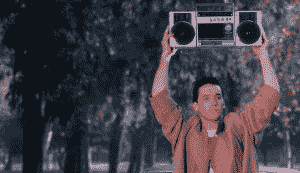

# 如何变得对女性更有吸引力

> 原文：<http://manlymenblog.com/2018/02/17/howtobecomemoreatttractivetowomen/>

如果你是一个生活在地球上的男人，我敢打赌你喜欢对女人有吸引力！

可悲的是，当谈到理解和吸引女性时，许多男性都很难。

他们似乎就是搞不懂女人想要什么。

但是为什么男人在这个特殊的领域会有困难呢？毕竟，他们一生都在做社会告诉他们要做的事情。那为什么没用？他们都试图成为完美的绅士或白衣骑士，但结果看起来仍然很差。

我是来告诉你忘记这个世界教给你的东西，开始看清真相。为了增加你在女性中的成功，你必须明白你得到的关于吸引力和诱惑的大部分信息都是完全错误的！

不只是现代男人不懂女人。**连女人都不了解自己。他们在男人身上寻找什么？她试图弄清楚她的梦中情人长什么样，以及男人应该如何表现。奇怪的是，当男人意识到这些事情并开始这样做时，女人根本没有反应。另一方面，这个人越来越沮丧，因为他认为他做的都是对的。**

***那么这些信息是从哪里来的？***

***答案无处不在。***

首先，作为年轻的男孩，男人会得到他们善意的母亲的建议。他们希望他们的儿子成为未来妻子的完美丈夫。这里的问题是，她已经离开“游戏”很久了，以至于记不起当初是什么吸引了她丈夫。

此外，吸引主要发生在潜意识层面。女人知道她们什么时候被某人吸引，但是她们通常不知道为什么。例如，许多女人很容易对坏男孩类型感到“刺痛”，尽管她们知道他是个坏消息。与此同时，那位就在眼前，一直对她很好的绅士，却常常被抛在后面。

**[相关帖子:如何判断她是否喜欢你](http://manlymenblog.com/2018/12/22/how-to-tell-if-she-likes-you/)**

全世界的母亲都在告诉他们的儿子要对女人温柔体贴。他们告诉他们，他们必须成为完美的绅士，女人应该像公主一样被对待，被放在一个基座上。他们应该用赞美、鲜花、礼物……来款待他们，并且确保你不要忘记为他们的饮料买单他们被告知浪漫是通往他们心灵的道路。

我并不是说对女性友善是件坏事！不尊重女性，不会让你成为更好的男人。

我只是说这和吸引和诱惑没有任何关系，绝对没有关系。 [Yo](http://manlymenblog.com/2018/02/17/become-the-alphamale/) 你可以很好；只是不要成为“好人”。

 ** *好男人总是最后完成。不要成为那样的人，除非你只想成为她的朋友。***

“真对不起！”“你太可爱了，”“你真是个好人！”"总有一天你会让其他女人非常幸福。""你不是我喜欢的类型。"“你对我太好了”“我当然愿意和你做朋友。”

如果你曾经听过这些句子中的一句，那么是时候改变你与女性互动的方式了。

是时候你开始看到你被洗脑了。不仅仅是女性(不合时宜地)，大众媒体也应该为此负责。你在浪漫的好莱坞电影里看到的都是男人做了 90 分钟的错事，最终得到了女孩！最常见的是，在一个夸张的浪漫姿态“让她神魂颠倒”之后，他得到了她

***这是否意味着女性不喜欢浪漫？不，他们当然还是喜欢，但只是和他们喜欢的人。大多数男人没有意识到这一点，并跳过了这重要的一步:吸引力是第一位的。***

说到女人，很多男人都扮演了错误的角色。当他接近或交流时，他扮演一个顺从的角色。他在想:“哇，她真漂亮”“如果我能得到她呢？光是和她说话，他就几乎有罪恶感，他觉得自己配不上她。

***好吧，如果你不相信自己，她又何必呢？***

他实际上做的是对她的美丽做出回应。他承认她比他更有价值，更有力量。他把她放在一个想象的基座上。其实应该反过来:

**男人就是刺激。男人拥有力量，当他发出正确的信号时，女人会回应以对男人的吸引力。**可悲的是，大多数男人都忘记了自己拥有这种力量；因为社会规定女人是性的象征，男人是追求者。无论她看起来有多漂亮或拥有多大的权力，她只是一个渴望被自己的对立面迷住的自然存在: [**真实、纯洁和原始的男子气概**。](http://manlymenblog.com/2018/02/17/become-the-alphamale/)

很多男人认为女人和男人一样讨厌性或者不喜欢性。不是这样的。他们不会把它给一个配不上她的男人。再加上她每次做爱都要考虑自己的名声。她不会为了一个似乎没什么价值的男人而冒险损害自己的社会地位。为了让她和你做爱，你必须值得去冒险。

停止给刚认识的女人买礼物。不要一直给她打电话发短信。别追她了。不要把钱花在昂贵的晚餐上。不要用不必要的、不值得的赞美来压制她。

立即停止这些行为，因为它们都是寻求认可和关注的行为，给了她所有的权力，降低了你的价值。你给她的印象是你需要从她那里得到什么，而不是提供她的价值。这会给她造成巨大的压力，这些行为是吸引力杀手:

如果某样东西是免费的，人们会认为它毫无价值。因为当它有价值时，你通常必须为之努力。

翻译:女人只会把你看作一个有价值的男人，如果她不得不为之努力的话。你的关注和陪伴不是免费的，而是应得的。你认为一个有很高价值，能得到很多女人的男人会追她吗？你认为他会给她买礼物吗？他会变得很饥渴吗？他会在乎是否得到了这个女孩的电话号码吗？

不，他还有十个辣妹排队等着和他在一起。他来自一个丰富的思想，他没有结果依赖。他不需要她，因为他的生活已经足够有趣，这一事实让他很有吸引力。好像女人都能闻出来。能成为其中的一员，她会感到很幸运。

**[(相关帖子:如何征服进场焦虑)](http://manlymenblog.com/2018/11/05/conquer-approach-anxiety/)**

**You are the prize, not her.  Make her chase you…**

***那么是什么让男人对女人有吸引力呢？是什么让女人追你？***

男人可以拥有某些特质来创造吸引力:它们被称为吸引力开关。它们表明你是一个高价值的人，你是一个值得追求的目标。如果你能充分证明你拥有这些品质，并一个一个地打开这些开关，她将别无选择，只能对你产生吸引力。重要提示:仅仅因为一个女人被你吸引，并不自动意味着她会和你上床。举个例子:一个已婚女人可能会完全被另一个男人迷住，但仍然选择忠于她的丈夫。

另外，吸引力只是第一阶段；你必须学会如何勾引她，营造舒适感，如何在身体上升级，并达成交易。但是通过所有这些阶段，你需要保持吸引力。除此之外，如果你处于一段长期关系中，或者甚至已经结婚好几年了，吸引力是至关重要的。如果她失去了它，你就有被欺骗或离婚的风险。不要责怪她，因为保持吸引力是你的工作。她值得一个真正的男人。

***现在让我们开门见山。下面是最重要的景点开关:***

*   拥有金钱/财富，尽管这更多的是创造一种安全感、稳定感和舒适感。

这就是了。正如你所看到的，吸引女人和吸引男人有很大的不同。男人通常更关注外表和美貌，而女人的吸引力开关则更多样。这给了你在许多层面上提高自己的机会。

在这个博客上，我提倡**在各个层面上提高自己**。

***努力成为尽可能最好的自己，但为你而做，只为你自己。***

不要只是为了获得女性更多的兴趣而去做。而是为了创造更好更有趣的生活。毕竟，当你成为最好版本的自己，女人自然会来。在那个时候，和女人相处会是你最不想做的事情，你不会有时间去担心它。

[在这里下载你的免费电子书](https://mailchi.mp/896b52eba5bd/manly-men-blog-e-book)