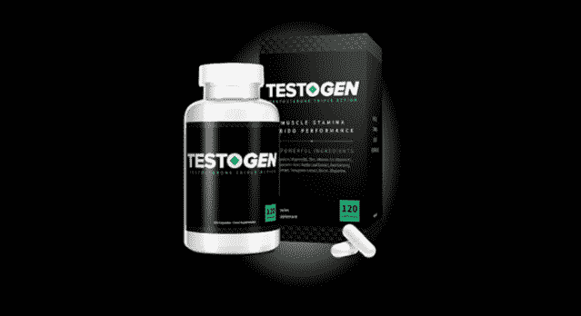
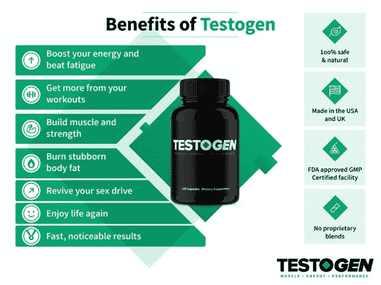
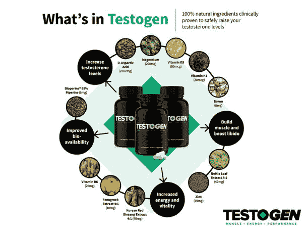
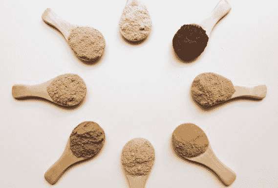
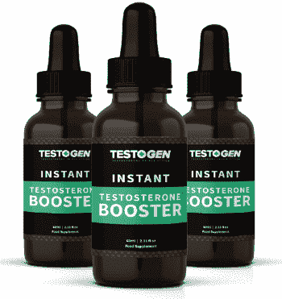
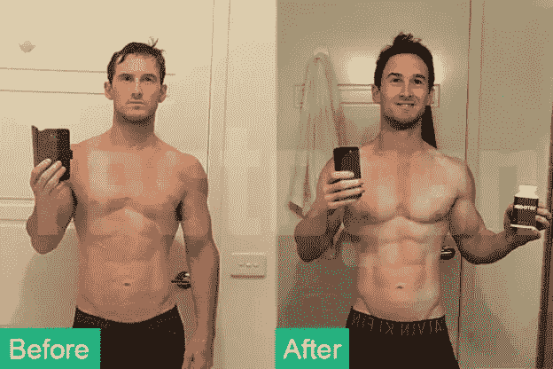

# Testogen 评论:真的有效吗？

> 原文：<http://manlymenblog.com/2021/10/27/testogen-review-does-it-really-work/>

你有没有感觉到自己在空虚中奔跑？你是否觉得自己没有足够的精力度过一天？运动只是让你觉得累吗？你没有得到结果，你只是增加体重吗？

如果这听起来像你，那可能是你的睾丸激素水平在作怪！

**睾丸素**是一种**睾丸素增强剂**，用于自然增加体内睾丸素水平。但是它真的有用吗，值得吗？

当男人变老时，睾丸激素的分泌会不可避免地缓慢下降。当你的睾丸激素水平下降时，它会表现为**低能量水平**，持续**疲劳**，更多**压力**，**性欲下降**，**体重增加**以及总体健康状况变差。可悲的是，它也会影响男性的心理健康。所以很自然，我们很多男人都想逆转这些变化。

因此，睾丸激素增强剂出现了。它们被用作一种自然增加体内睾丸激素水平的方法。他们在那些想要变得强壮、、减掉多余的体重、提高性能力、减少性功能障碍的男性中变得非常受欢迎。这是一种获得改善睾丸激素产生的所有健康益处的方法，没有任何有害的化学物质和令人讨厌的副作用。

市场上最受欢迎的产品之一是 [TestoGen](https://mixi.mn/?a=195850&c=8425&p=r&s2=https://testogen.com/order-now/&ckmrdr=https://testogen.com/order-now/) ，这是一种声称是**高质量天然补充剂**的产品，效果非常好。请继续阅读，了解更多关于睾酮的信息，以及服用睾酮的利与弊。

## 什么是 Testogen？

TestoGen 是一种天然的睾酮增强剂，专为希望提高睾酮产量并自然增加其水平的男性而设计。自推出以来，Testogen 获得了数千名忠实客户。他们称赞这种补充剂有助于提高他们的能量水平，改善运动表现，减肥，变得更强壮，恢复性欲，看起来和感觉起来更年轻，以及其他健康益处。

睾丸素由 11 种天然成分制成，经科学证明，这些成分有助于身体产生睾丸素，并提高游离睾丸素水平。这些成分包括**维生素、矿物质、氨基酸和草药提取物**。这是一种天然补充剂，也就是说不含合成填充物或人造睾丸激素。这样，它几乎没有副作用，不良反应的风险也极低。所有的成分都有科学研究的支持，所以可以安全使用。你可以从胶囊或滴剂中得到它。

**Testogen 设计用于**:

*   帮助你睡得更好，醒来神清气爽。
*   提高能量水平
*   减轻疲劳。
*   更快地锻炼肌肉。
*   增加力量。
*   燃烧顽固的体脂。
*   增加你的性欲。
*   增加活力和情绪

## Testogen 是如何工作的？

Testogen 主要以三种方式工作:

*   它刺激睾丸激素的产生。
*   它能提高游离睾酮水平。
*   它减缓了睾丸激素向雌激素的转化。

为了弄清楚 Testogen 是如何做到这一点的，我们需要看看它的主要成分:

### 睾酮的成分

TestoGen 由 11 种天然成分制成。之所以选择这些药物，是因为它们能很好地相互配合，自然地增加你身体产生的睾丸激素的量。TestoGen 中使用的成分有:

**镁:**

该产品含有 200 毫克镁，通过增加体内酶的数量来增加睾丸激素的产量，这些酶对任何激素的产生都是必不可少的。

**锌:**

这种成分存在于你全身的细胞中，在分解糖、细胞分裂、伤口愈合、细胞生长以及支持我们的嗅觉和味觉方面起着重要作用。它对提高低睾酮水平也至关重要。这项[研究](https://pubmed.ncbi.nlm.nih.gov/8875519/)显示，低锌饮食会导致睾丸激素水平在短短 20 周后直线下降，而高锌饮食会使睾丸激素水平提高 50%。

**硼:**

这种成分有助于防止勃起功能障碍，同时还能改善肌肉质量和骨骼强度。硼是一种天然矿物质，已被证明能够“显著”降低 SHBG 水平，有助于提高游离睾酮水平。硼还可以减少一种叫做雌二醇的雌激素，增加血液中睾酮的含量。

**D-天冬氨酸:**

睾丸素含有 2352 毫克的 D-天冬氨酸，这是一种氨基酸调节剂，被证明可以提高睾丸素水平。[这项研究](https://pubmed.ncbi.nlm.nih.gov/19860889/)发现，年龄在 27-37 岁之间的男性服用 D-天冬氨酸 12 天后，其睾丸激素水平平均增加了 42%。

**朝鲜红参提取物:**

这种成分非常有效地提升你的情绪，改善你的性能力和性欲。韩国红参，也被称为亚洲人参和人参，具有增强性欲和睾丸激素的作用。[这项为期 8 周的研究](https://www.ncbi.nlm.nih.gov/pmc/articles/PMC3735289/)发现，它将勃起功能障碍(ed)男性的性欲提高了 30%，而这项[临床试验](https://pubmed.ncbi.nlm.nih.gov/9063034/)得出结论，人参可以增加游离和总睾酮。

**维生素 K1:**

这种维生素对骨骼强度至关重要，尤其是当我们变老的时候。强壮的骨骼也能够更好地吸收维生素 D，这有助于增加睾丸激素的产生。

**维生素 B6:**

这种维生素被认为在男性生殖系统中发挥着重要作用。睾酮中含有 20 毫克的维生素 B6，有助于自然提高低睾酮水平。

**荨麻叶提取物:**

这种成分可以释放束缚形式的睾丸激素，这有助于提高你的性欲。荨麻叶含有一种叫做“木脂素”的化合物，可以阻止性激素结合球蛋白(SHBG)与睾酮结合。这项研究[显示](https://pubmed.ncbi.nlm.nih.gov/7700987/)荨麻木脂素可以减少高达 67%的 SHBG 结合，而这篇[研究论文](https://pubmed.ncbi.nlm.nih.gov/17509841/)得出结论，荨麻提取物可以帮助阻止睾酮转化为雌激素

**胡芦巴提取物:**

这是一种具有多种不同益处的成分，包括增强耐力和力量，提高睾丸激素水平。胡芦巴植物原产于印度和北非，含有高含量的呋甾皂苷。根据这项[为期 8 周的研究](https://www.ncbi.nlm.nih.gov/pmc/articles/PMC2978122/)，胡芦巴提取物可以显著提高睾丸激素水平和强度。一项[为期 12 周的研究](https://www.ncbi.nlm.nih.gov/pmc/articles/PMC5278660/)发现这种提取物增加了 90%参与者的睾丸激素。

**维他命 D3:**

这种成分可以在许多方面对你的健康有益，包括减少骨质流失和体内甲状旁腺激素的水平。它还能提高睾丸激素水平。

**生物丝氨酸 95%胡椒碱:**

最后，这个成分比你想象的更重要。虽然它对睾丸激素的产生没有直接影响，但它确实有助于你的身体吸收补充剂中的所有其他成分。

## 睾酮即时增强滴剂

使 TestoGen 在其他睾酮补充剂中脱颖而出的是[即时增强滴剂](https://mixi.mn/?a=195850&c=8425&p=r&s2=https://testogen.com/order-now/&ckmrdr=https://testogen.com/order-now/)。滴剂的设计是为了和胶囊一起发挥最终的增强效果。

TestoGen 助推器下降有 7 个强大的组成部分。它们被直接输送到你的血液中。他们的目标是给你一个**瞬间的能量提升**，增加力量和注意力。

它们可以每天服用 3 次，在你需要快速补充的时候服用。

如果你既想买胶囊又想买滴剂，你可以把它们组合在一起，享受很大的折扣。

## 睾丸激素的利与弊

每份增刊都有正反两面。Testogen 也不例外。让我们来看看:

### 优点:

*   它自然地增加睾丸激素水平。所有的天然成分都是为了共同促进你体内睾丸激素的产生而设计的。
*   它会增强你的力量，帮助你建立瘦而强壮的肌肉
*   它可以改善你的情绪和心理健康。
*   它含有 100%天然和经过验证的成分，**没有化学垃圾**
*   这会增强你的性欲和自信心。你好力比多！
*   这将有助于促进你的新陈代谢。
*   你可以得到胶囊形式的**和滴剂形式的**。这使得它更容易和更有效。****
*   **它产生了快速的效果，大多数人在开始服用该产品的两周内就注意到了积极的变化。**
*   ****透明剂量**:你可以在他们的网站上找到 Testogen 的成分，包括它在胶囊中的确切剂量。**
*   ****FDA 认证**:该公司声称其产品来自美国和英国的制造商，这些制造商拥有 [FDA](https://www.fda.gov/) 的认证。**
*   **退款保证:顾客可以在送货后 100 天内获得全额退款。**
*   ****捆绑交易**:你可以通过[购买捆绑交易](https://mixi.mn/?a=195850&c=8425&p=r&s2=https://testogen.com/order-now/&ckmrdr=https://testogen.com/order-now/)来省钱**
*   ****所有订单均免运费****

**

### con’s

*   这不是最便宜的产品。但是质量是有价格的。
*   为了获得最佳结果，你需要**仔细遵循指南**
*   在你附近的商店买不到。你可以在 www.testogen.com在线购买
*   **这不是真正的睾丸激素。与睾酮替代疗法相比，它使用天然替代品来增加其产量。**

 **## 安全吗，有副作用吗？

由于睾丸素的成分是全天然的，这种睾丸素增强剂对你身体的副作用是非常罕见的。它是在 FDA 批准的实验室制造的，不含化学物质。

然而，目前没有关于使用 Testogen 产品的长期影响的研究。当然，如果你有特定的过敏症，也有可能产生副作用。如果你对此有所担心，一定要咨询医生。

## Testogen 退款保证

睾酮补充剂需要一段时间才能开始发挥作用。TestoGen 会让你安心。Testogen 有 100 天的试用期保证。如果你发现它不适合你，你可以拿回你的钱。

## 顾客在说什么？

在他们的网站上，Testogen 声称已经帮助全球 79，893 名男性提高了睾酮水平。但是这些人在说什么呢？请务必查看这些客户评价:

### 美国佛朗哥——能源水平比以往任何时候都高

**目标:**重获保持良好身材所需的动力和能量水平，并缩短锻炼之间的恢复时间。

**使用 Testogen 1 个月后:**

*   精力充沛(尤其是在早上)
*   减少肌肉酸痛
*   更多肌肉和清晰度

“我已经使用 Testogen 超过一个月了。我喜欢它！

我注意到我一整天都有更多的能量，尤其是在锻炼的时候。我觉得我比以前更好看了。感觉又回到了 20 出头。

我强烈推荐任何人使用这个。它会提高你的生活质量。"

 [https://www.youtube.com/embed/NJXabuRHIi8?version=3&rel=1&showsearch=0&showinfo=1&iv_load_policy=1&fs=1&hl=en-US&autohide=2&start=102&wmode=transparent](https://www.youtube.com/embed/NJXabuRHIi8?version=3&rel=1&showsearch=0&showinfo=1&iv_load_policy=1&fs=1&hl=en-US&autohide=2&start=102&wmode=transparent) 

### 澳大利亚凯尔——在 Testogen 的帮助下，现在成功地平衡了工作、培训和家庭生活

 **目标:**增加能量，重新活跃起来

**使用 Testogen 7 周后:**

*   即使在漫长的一天工作后也更有活力
*   能够每周训练 5 天，仍然有精力做家庭晚餐
*   增强信心

“我购买这款产品是因为感觉精力(两个孩子)、工作生活有点低落，最近做了输精管切除术，我觉得我的睾丸激素水平需要提高。我也想通过力量训练重新活跃起来。我可以看到你的产品，看起来你有很多快乐的顾客，所以我想我会尝试一下。

我已经使用你们的产品大约 7 周了，老实说，我确实感觉到并看到了变化，毫无疑问，即使在漫长的一天工作后，我也感觉更有活力，我一直是一个健康的饮食者，所以这种促进肯定来自睾酮，而不是其他。我已经能够每周训练 5 天，每天 45 分钟，并且仍然有精力为家人做饭。

谢谢你提升了我的自信、快乐…和睾丸激素！

## 美国布伦特——外观和感觉都比以往更好

 [https://www.youtube.com/embed/0ObVglUoqAk?version=3&rel=1&showsearch=0&showinfo=1&iv_load_policy=1&fs=1&hl=en-US&autohide=2&wmode=transparent](https://www.youtube.com/embed/0ObVglUoqAk?version=3&rel=1&showsearch=0&showinfo=1&iv_load_policy=1&fs=1&hl=en-US&autohide=2&wmode=transparent) 

## 去哪里买 Testogen？

Testogen 仅在[公司的官方网站](https://mixi.mn/?a=195850&c=8425&p=r)上有售

## 如何服用 Testogen？

睾丸素主要以胶囊形式出售。一般的建议是用一杯水冲服所有四粒胶囊。至少在早餐前 20 分钟这样做。这将有助于确保适当的吸收。睾丸素胶囊很小，但是如果你吞咽有困难，你仍然可以把药片打开放进水里，这样就可以喝了。

## 合法吗？

是的，是合法的！这种补充剂不含真正的睾丸激素。也不含任何其他受管制物质。你可以自由购买和使用它，无需处方。

## 结论

睾酮肯定是一个伟大的睾酮助推器。这是一种自然提高睾丸激素水平的有效方法，给你能量、健康和信心，而没有副作用的风险。

速溶咖啡给这种补充剂增加了价值。在胶囊可能不那么有效的情况下，它是有用的，可以有效地相互补充。

如果你对 TestoGen 能为你做什么感到好奇，我们强烈建议你试一试。这是一家声誉卓著的老牌公司，会兑现退款承诺。试用 100 天。这有足够的时间来决定 TestoGen 是否适合你，或者你是否想要回你的钱。

准备好试试了吗？在 Testogen 的[官网](https://mixi.mn/?a=195850&c=8425&p=r)查看。****